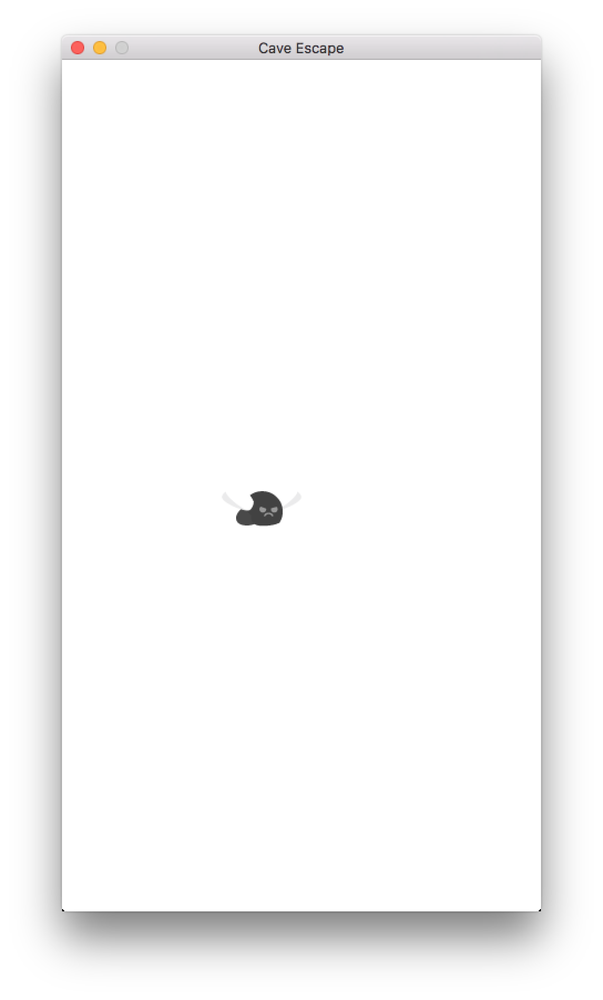

# 1. Iteration One

In the **First Iteration** of **Cave Escape**, you will implement the boiler plate **Code** for a simple **Game**. The boiler plater **Code** includes the instructions to open a **Graphics Window** and a basic **Game Loop**, where all of the instructions that you implement will be called from.

### What to Expect

Once you're finished working through and implementing **Iteration One**, you should have something that looks just like this:

That's it! Just a blank **Graphics Window**, but we'll work on that blank canvas in future iterations.

### Code

##### - Complete Code
The complete **Code** for **Iteration One** is as follows:

```pascal
program GameMain;
uses SwinGame, sgTypes, sgTimers, sgSprites, sysUtils;

procedure Main();
begin
  OpenGraphicsWindow('Cave Escape', 432, 768);

  repeat // The Game Loop...
    ProcessEvÂents();

    ClearScreen(ColorWhite);
    RefreshScreen();

  until WindowCloseRequested();
end;

begin
  Main();
end.
```

##### - How it's Working
The ```Main()``` **Procedure**, as demonstrated in the **Code** above, is responsible for executing all of the instructions required for our **Game** to run. The instructions are executed in **Sequence**, meaning that the **Code** within the ```Main()``` **Procedure** will be executed in the exact order in which it is specified.

So, that being said, let's take a moment to analyse the ```Main()``` **Procedure** and the **Instructions** it is executing. The **Sequence** is as follows:

  1. Firstly, a call to ```OpenGraphicsWindow()``` is made, where we can see the title of the **Window** being opened is *Cave Escape* and the *width* and *height* of the **Window** is 432 by 768 pixels.
  2. The **Game Loop** is opened. The **Game Loop** will **Loop** over and over, until the user closes the **Window**, meaning all of the instruction will be continually executed for as long as the **Loop** is running. Note that the condition of the **Loop** is ```WindowCloseRequested()```.
     * The following instructions are executed within the **Game Loop**:
      1. ```ProcessEvents()``` is called. ```ProcessEvents()``` is used to listen for any user input made while the program is running.
      2. We then clear the screen with ```ClearScreen()``` before we draw anything to it (we're not drawing anything in this **Iteration**, but that will come soon!).
      3. We then refresh the screen with ```RefreshScreen()``` so that we can see what we've drawn.

### Have a Crack
Now it's time for you to have a go at implementing **Iteration One** on your own. You'll have to type the **Instructions** above into your **Text Editor**. **Try and resist the urge to Copy and Paste** **Code** if it arrises, as typing it out helps build your understanding in regards to what the **Code** is doing. When you're done, you'll need to **Build** and **Run** your **Code** to see if it is all working. If you encounter any **Build Errors**, you'll have to resolve those and **Build** and **Run** again.

---
# 2. Iteration Two

In the second **Iteration** of **Cave Escape**, you will implement the functionality to have your **Game** produce a graphical representation of the **Player**. The **Player** will be drawn to the centre of the **Graphics Window** and come complete with an animation!

### What to Expect

Once you're finished working through and implementing **Iteration Two**, you should have something that looks just like this:

What's different from **Iteration One**? We've got a graphical representation of the **Game's** **Player**! Now let's take a look at how this is implemented.

### Code

##### - New Code
The new **Code** in **Iteration Two** is as follows:

Addition one
```pascal    
function GetNewPlayer(): Sprite;
begin
  result := CreateSprite(BitmapNamed('Player'), AnimationScriptNamed('PlayerAnimations'));
  SpriteSetX(result, ScreenWidth() / 2 - SpriteWidth(result));
  SpriteSetY(result, ScreenHeight() / 2);
  SpriteStartAnimation(result, 'Fly');
end;
```

##### - What's the New Code Doing?
```GetNewPlayer()``` **Function**, as demonstrated in the **Code** above, is used to generate the data associated with the **Player** entity that we'll be using in our **Game**. It's important to note that **Functions** use a special **Variable** called ```result``` to store the value in that they calculate. So, in short, the **Function** is creating a **Sprite** for the **Player**, setting the **Sprite's** location to the centre of the screen and setting an animation for the **Sprite**. Once the **Function** finishes, it returns the **Sprite** it creates (the ```result``` **Variable**).

##### - Complete Code
The complete **Code** for **Iteration Two** is as follows:
```pascal
program GameMain;
uses SwinGame, sgTypes, sgTimers, sgSprites, sysUtils;

function GetNewPlayer(): Sprite;
begin
  result := CreateSprite(BitmapNamed('Player'), AnimationScriptNamed('PlayerAnimations'));
  SpriteSetX(result, ScreenWidth() / 2 - SpriteWidth(result));
  SpriteSetY(result, ScreenHeight() / 2);
  SpriteStartAnimation(result, 'Fly');
end;

procedure Main();
var
  player: Sprite;
begin
  OpenGraphicsWindow('Cave Escape', 432, 768);
  LoadResourceBundleNamed('CaveEscape', 'CaveEscape.txt', false);

  player := GetNewPlayer();

  repeat // The game loop...
    ProcessEvents();
    ClearScreen(ColorWhite);
    UpdateSprite(player);
    DrawSprite(player);
    RefreshScreen();
  until WindowCloseRequested();
end;

begin
  Main();
end.
```

#### - You've Changed, Main
Take a close look at the **Complete Code** above and review the ```Main()``` **Procedure**. A few things have changed in order to cater for our new ```GetNewPlayer()``` **Function** as well as drawing our **Player** to the screen. The **Sprite** that the **Function** ```GetNewPlayer()``` returns is assigned to a **Variable** called ```player``` and then within the **Game Loop**, the **Player** **Sprite** is updated and drawn.

### Have a Crack
Now it's time for you to have a go at implementing **Iteration Two** on your own. As before, you'll have to type the **Instructions** above into your **Text Editor**. Continue to **Try and resist the urge to Copy and Paste** **Code** if it arrises, as typing it out helps build your understanding in regards to what the **Code** is doing. When you're done, you'll need to **Build** and **Run** your **Code** to see if it is all working. If you encounter any **Build Errors**, you'll have to resolve those and **Build** and **Run** again.

---
# 3. Iteration Three

In the **Third Iteration** of **Cave Escape**, you will implement the functionality to give your **Player** the ability to fly! Well, almost. You're going to add some velocity to the **Player** so that it's not just stuck in the middle of the screen, instead, when you're finished, the **Player** will fall right off the bottom of the screen!

### What to Expect

Once you're finished working through and implementing **Iteration Three**, you should have something that looks just like this:

So with some velocity, the **Game** is a little more dynamic than it previously was in **Iteration Two**.

### Code

##### - New Code
The new **Code** in **Iteration Three** is as follows:

Addition one
```pascal
const
  GRAVITY = 0.08;
  MAX_SPEED = 5;
```

Addition two
```pascal    
procedure UpdateVelocity(player: Sprite);
begin
  SpriteSetDy(player, SpriteDy(player) + GRAVITY);

  if SpriteDy(player) > MAX_SPEED then
  begin
    SpriteSetDy(player, MAX_SPEED);
  end
  else if SpriteDy(player) < -(MAX_SPEED) then
  begin
    SpriteSetDy(player, -(MAX_SPEED));
  end;
end;
```

##### - What's the New Code Doing?
We've taken the time to add some **Constant** values that are going to be used in the calculation of the **Player's** velocity. Those values represent an imposed ```GRAVITY``` and a ```MAX_SPEED``` in regards to what we want to impose as the maximum velocity the **Player** can move, or fall at. The ```UpdateVelocity()``` **Procedure**, as demonstrated in the **Code** above, uses these two new **Constant** values to determine what the **Player's** speed will be by using **Conditional** **Statements**. The **Conditional** **Statements** ensure that ```if``` the **Player** is not already falling at the ```MAX_SPEED```, increase it's velocity, ```else```, if the **Player** is already falling at the ```MAX_SPEED```, ensure that if stays falling at the ```MAX_SPEED``` rather than going any faster.

##### - Complete Code
The complete **Code** for **Iteration Three** is as follows:
```pascal
program GameMain;
uses SwinGame, sgTypes, sgTimers, sgSprites, sysUtils;

const
  GRAVITY = 0.08;
  MAX_SPEED = 5;

function GetNewPlayer(): Sprite;
begin
  result := CreateSprite(BitmapNamed('Player'), AnimationScriptNamed('PlayerAnimations'));
  SpriteSetX(result, ScreenWidth() / 2 - SpriteWidth(result));
  SpriteSetY(result, ScreenHeight() / 2);
  SpriteStartAnimation(result, 'Fly');
end;

procedure UpdateVelocity(player: Sprite);
begin
  SpriteSetDy(player, SpriteDy(player) + GRAVITY);

  if SpriteDy(player) > MAX_SPEED then
  begin
    SpriteSetDy(player, MAX_SPEED);
  end
  else if SpriteDy(player) < -(MAX_SPEED) then
  begin
    SpriteSetDy(player, -(MAX_SPEED));
  end;
end;

procedure Main();
var
  player: Sprite;
begin
  OpenGraphicsWindow('Cave Escape', 432, 768);
  LoadResourceBundleNamed('CaveEscape', 'CaveEscape.txt', false);

  player := GetNewPlayer();

  repeat // The game loop...
    ProcessEvents();
    ClearScreen(ColorWhite);
    UpdateVelocity(player);
    UpdateSprite(player);
    DrawSprite(player);
    RefreshScreen();
  until WindowCloseRequested();
end;

begin
  Main();
end.
```

#### - Take a Look at Main
The ```Main``` **Procedure** has now changed. Notice that in the **Game Loop**, there's now a call to the new **Procedure** ```UpdateVelocity()```. This ensures that for each time the **Game Loop** executes, we're ensuring that we're updating the **Player's** velocity accordingly.


### Have a Crack
Now it's time for you to have a go at implementing **Iteration Three** on your own. Give it a crack and see how you go.

---
# 4. Iteration Four

In the **Fourth Iteration** of **Cave Escape**, we will actually implement the ability to have you control the way the **Player** flies. Instead of the **Player** just falling into the abyss, as it was in **Iteration Three**, **Iteration Four** sees the inclusion of the logic required to keep the **Player** on the screen by using keyboard input. In particular, we're going to make it so that every time the **Space Bar** is pressed, the **Player** is going to fly a little higher, and further away from the bottom of the screen.

### What to Expect

Once you're finished working through and implementing **Iteration Four**, you should have something that looks just like this:

Look at that! Control over the **Players** velocity!

### Code

##### - New Code
The new **Code** in **Iteration Four** is as follows:

Addition one
```pascal
JUMP_RECOVERY_BOOST = 2;
```

Addition two
```pascal    
procedure HandleInput(player: Sprite);
begin
  if KeyTyped(SpaceKey) then
  begin
    SpriteSetDy(player, SpriteDy(player) - JUMP_RECOVERY_BOOST);
  end;
end;
```

##### - What's the New Code Doing?
In order to be able to control the **Player's** velocity with user input, we've had to add a new **Constant** value called ```JUMP_RECOVERY_BOOST```. The reason for this will become more clear when we talk about the new **Procedure** ```HandleInput()```, which is exactly what we're going to do now. The new **Procedure** ```HandleInput()``` is implemented to listen for user input while the **Game** is running. Specifically, the input it's listening for when the **Space Bar** is pressed. Every time the **Space Bar** is pressed, the ```HandleInput()``` **Procedure** will decrement the value of the **Constant** ```JUMP_RECOVERY_BOOST``` from the **Player's** current velocity, meaning, that each time the **Space Bar** is pressed, the **Player** will fall a little slower, but only briefly. The aim is to have the user continually press the **Space Bar** to keep the **Player** on the screen and give it the affect of flying!

##### - Complete Code
The complete **Code** for **Iteration Four** is as follows:

```pascal
program GameMain;
uses SwinGame, sgTypes, sgTimers, sgSprites, sysUtils;

const
  GRAVITY = 0.08;
  MAX_SPEED = 5;
  JUMP_RECOVERY_BOOST = 2;

function GetNewPlayer(): Sprite;
begin
  result := CreateSprite(BitmapNamed('Player'), AnimationScriptNamed('PlayerAnimations'));
  SpriteSetX(result, ScreenWidth() / 2 - SpriteWidth(result));
  SpriteSetY(result, ScreenHeight() / 2);
  SpriteStartAnimation(result, 'Fly');
end;

procedure HandleInput(player: Sprite);
begin
  if KeyTyped(SpaceKey) then
  begin
    SpriteSetDy(player, SpriteDy(player) - JUMP_RECOVERY_BOOST);
  end;
end;

procedure UpdateVelocity(player: Sprite);
begin
  SpriteSetDy(player, SpriteDy(player) + GRAVITY);

  if SpriteDy(player) > MAX_SPEED then
  begin
    SpriteSetDy(player, MAX_SPEED);
  end
  else if SpriteDy(player) < -(MAX_SPEED) then
  begin
    SpriteSetDy(player, -(MAX_SPEED));
  end;
end;

procedure Main();
var
  player: Sprite;
begin
  OpenGraphicsWindow('Cave Escape', 432, 768);
  LoadResourceBundleNamed('CaveEscape', 'CaveEscape.txt', false);

  player := GetNewPlayer();

  repeat // The game loop...
    ProcessEvents();
    ClearScreen(ColorWhite);
    UpdateVelocity(player);
    HandleInput(player);
    UpdateSprite(player);
    DrawSprite(player);
    RefreshScreen();
  until WindowCloseRequested();
end;

begin
  Main();
end.
```

#### - Main has Changed, Again
The ```Main``` **Procedure** has now changed. Notice that in the **Game Loop**, there's now a call to the new **Procedure** ```HandleInput()```. This ensures that for each time the **Game Loop** executes, we're ensuring that we're listening for any user input, specifically, if the **Space Bar** has been pressed. Now we have a more functional **Game** where the user finally has some control over the way the **Game** behaves.


### Have a Crack
Now it's time for you to have a go at implementing **Iteration Four** on your own.

---
# 5. Iteration Five

In the fifth **Iteration** of **Cave Escape**, we add quite a bit of functionality, more so than in the previous iterations. We're up for a big step with this one. We're going to add an obstacle. We'll refer to the obstacle as **Poles**. It's the aim of the **Game** to avoid the **Poles**, but we'll worry about that later. For now, let's just worry about getting the **Poles** onto the screen. So, this **Iteration** concerns the generation of a single set of **Poles** as well as the way the **Poles** behave.

### What to Expect

Once you're finished working through and implementing **Iteration Five**, you should have something that looks just like this:

While **Iteration Five** is quite a bit involved, in terms of new **Code** required, it adds loads of functionality to our **Game** and now, more than ever, it's looking more and more like a **Game**.

### Code

##### - New Code
The new **Code** in **Iteration Five** is as follows:

Addition one
```pascal
POLE_SCROLL_SPEED = -2;
```

Addition two
```pascal    
type
  PoleData = record
    UpPole: Sprite;
    DownPole: Sprite;
  end;
```

Addition three
```pascal    
function GetRandomPoles(): PoleData;
begin
  result.UpPole := CreateSprite(BitmapNamed('UpPole'));
  result.DownPole := CreateSprite(BitmapNamed('DownPole'));
  SpriteSetX(result.UpPole, ScreenWidth() + RND(1200));
  SpriteSetY(result.UpPole, ScreenHeight() - SpriteHeight(result.UpPole));
  SpriteSetX(result.DownPole, SpriteX(result.UpPole));
  SpriteSetY(result.DownPole, 0);
  SpriteSetDx(result.UpPole, POLE_SCROLL_SPEED);
  SpriteSetDx(result.DownPole, POLE_SCROLL_SPEED);
end;
```

Addition four
```pascal    
procedure UpdatePoles(var poles: PoleData);
begin
  UpdateSprite(poles.UpPole);
  UpdateSprite(poles.DownPole);
end;
```

Addition five
```pascal    
procedure DrawPoles(const poles: PoleData);
begin
  DrawSprite(poles.UpPole);
  DrawSprite(poles.DownPole);
end;
```

##### - What's the New Code Doing?
The **Poles** that we're adding to the **Game** will move horizontally across the screen, from left to right. In order to cater for this, we've added another **Constant** called ```POLE_SCROLL_SPEED``` in order to keep track of the speed at which the **Poles** travel across the screen. In order to be able to keep track of the data required to add the **Poles** to the **Game**, we've added a **Record** called ```PoleData```. If you take a look at the ```PoleData``` **Record**, you'll notice that it has two **Fields** as **Sprites**. ```PoleData``` needs two **Sprites** because one **Pole** will come down from the top of the screen and the other will come up from the bottom.

Now, we need some logic in order to be able to add the **Poles** to the **Game** so that we can see them. Firstly, we've got a new **Function** called ```GetRandomPoles()```, which is responsible for generating the data associated with the **Poles**. This **Function** behaves similarly to the **Function** ```GetNewPlayer()```, as discussed in **Iteration Two**. ```GetRandomPoles()``` assigns the top and bottom **Poles** their own **Sprites**, sets their x location to a random location off the far right of the screen (this is intentional because we want to see the **Poles** scroll onto the screen from the right) and sets their y locations so that they appear to be coming down from the top and up from the bottom of the screen. Finally, the **Function** assigns their **Delta X**, or horizontal movement speed to that of the value of the **Constant** ```POLE_SCROLL_SPEED```. A **Procedure** called ```UpdatePoles()``` has been added to update the **Poles** and another **Procedure** called ```DrawPoles()``` to draw the **Poles** to the screen.

##### - Complete Code
The complete **Code** for **Iteration Five** is as follows:
```pascal
program GameMain;
uses SwinGame, sgTypes, sgTimers, sgSprites, sysUtils;

const
  GRAVITY = 0.08;
  MAX_SPEED = 5;
  JUMP_RECOVERY_BOOST = 2;
  POLE_SCROLL_SPEED = -2;

type
  PoleData = record
    UpPole: Sprite;
    DownPole: Sprite;
  end;

function GetNewPlayer(): Sprite;
begin
  result := CreateSprite(BitmapNamed('Player'), AnimationScriptNamed('PlayerAnimations'));
  SpriteSetX(result, ScreenWidth() / 2 - SpriteWidth(result));
  SpriteSetY(result, ScreenHeight() / 2);
  SpriteStartAnimation(result, 'Fly');
end;

function GetRandomPoles(): PoleData;
begin
  result.UpPole := CreateSprite(BitmapNamed('UpPole'));
  result.DownPole := CreateSprite(BitmapNamed('DownPole'));
  SpriteSetX(result.UpPole, ScreenWidth() + RND(1200));
  SpriteSetY(result.UpPole, ScreenHeight() - SpriteHeight(result.UpPole));
  SpriteSetX(result.DownPole, SpriteX(result.UpPole));
  SpriteSetY(result.DownPole, 0);
  SpriteSetDx(result.UpPole, POLE_SCROLL_SPEED);
  SpriteSetDx(result.DownPole, POLE_SCROLL_SPEED);
end;

procedure HandleInput(player: Sprite);
begin
  if KeyTyped(SpaceKey) then
  begin
    SpriteSetDy(player, SpriteDy(player) - JUMP_RECOVERY_BOOST);
  end;
end;

procedure UpdateVelocity(player: Sprite);
begin
  SpriteSetDy(player, SpriteDy(player) + GRAVITY);

  if SpriteDy(player) > MAX_SPEED then
  begin
    SpriteSetDy(player, MAX_SPEED);
  end
  else if SpriteDy(player) < -(MAX_SPEED) then
  begin
    SpriteSetDy(player, -(MAX_SPEED));
  end;
end;

procedure UpdatePoles(var poles: PoleData);
begin
  UpdateSprite(poles.UpPole);
  UpdateSprite(poles.DownPole);
end;

procedure DrawPoles(const poles: PoleData);
begin
  DrawSprite(poles.UpPole);
  DrawSprite(poles.DownPole);
end;

procedure Main();
var
  player: Sprite;
  gamePoles: PoleData;
begin
  OpenGraphicsWindow('Cave Escape', 432, 768);
  LoadResourceBundleNamed('CaveEscape', 'CaveEscape.txt', false);

  player := GetNewPlayer();

  gamePoles := GetRandomPoles();

  repeat // The game loop...
    ProcessEvents();
    ClearScreen(ColorWhite);
    UpdateVelocity(player);
    HandleInput(player);
    UpdateSprite(player);
    DrawSprite(player);
    UpdatePoles(gamePoles);
    DrawPoles(gamePoles);
    RefreshScreen();
  until WindowCloseRequested();
end;

begin
  Main();
end.
```

#### - More Changes to Main
The ```Main``` **Procedure** has now changed. Notice that we're now using our new **Function** ```GetRandomPoles()``` and assigning the value it returns to a **Variable** called ```gamePoles```. In order to move the **Poles** across the screen and draw them, we've added the calls to the **Procedures** ```UpdatePoles()``` and ```DrawPoles()``` within the **GameLoop**.

### Have a Crack
Now it's time for you to have a go at implementing **Iteration Five** on your own.

---
# 6. Iteration Six

In the **Sixth Iteration** of **Cave Escape**, we're going to make a few additions to ensure that once the **Poles** move off the far left of the screen, they get moved back to off the right of the screen. This will ensure that the **Poles** can be reused as obstacles.

### What to Expect

Once you're finished working through and implementing **Iteration Six**, you should have something that looks just like this:

The **Poles** are much better when they wrap around the **Game** screen!

### Code

##### - New Code
The new **Code** in **Iteration Six** is as follows:

Addition one
```pascal
procedure ResetPoleData(var poles: PoleData);
begin
  FreeSprite(poles.UpPole);
  FreeSprite(poles.DownPole);
  poles := GetRandomPoles();
end;
```

Addition two (Note: ```UpdatePoles()``` has had **Code** added to it)
```pascal    
procedure UpdatePoles(var poles: PoleData);
begin
  UpdateSprite(poles.UpPole);
  UpdateSprite(poles.DownPole);

  if ((SpriteX(poles.UpPole) + SpriteWidth(poles.UpPole)) < 0) and ((SpriteX(poles.DownPole) + SpriteWidth(poles.DownPole)) < 0) then
  begin
    ResetPoleData(poles);
  end;
end;
```

##### - What's the New Code Doing?
We've added a new **Procedure** called ```ResetPoleData()``` that is going to reset the **Poles** once they move off the screen. Notice that it calls the **Function** ```GetRandomPoles()``` that we implemented before. It makes sense to reuse **Code** where you can, and the **Poles** that the **Function** ```GetRandomPoles()``` returns are exactly what we need when we have to reset them. We've modified ```UpdatePoles()``` to check to see if the **Poles** have moved off the screen and ```if``` they have, we simply reset them.

##### - Complete Code
The complete **Code** for **Iteration Six** is as follows:
```pascal
program GameMain;
uses SwinGame, sgTypes, sgTimers, sgSprites, sysUtils;

const
  GRAVITY = 0.08;
  MAX_SPEED = 5;
  JUMP_RECOVERY_BOOST = 2;
  POLE_SCROLL_SPEED = -2;

type
  PoleData = record
    UpPole: Sprite;
    DownPole: Sprite;
  end;

function GetNewPlayer(): Sprite;
begin
  result := CreateSprite(BitmapNamed('Player'), AnimationScriptNamed('PlayerAnimations'));
  SpriteSetX(result, ScreenWidth() / 2 - SpriteWidth(result));
  SpriteSetY(result, ScreenHeight() / 2);
  SpriteStartAnimation(result, 'Fly');
end;

function GetRandomPoles(): PoleData;
begin
  result.UpPole := CreateSprite(BitmapNamed('UpPole'));
  result.DownPole := CreateSprite(BitmapNamed('DownPole'));
  SpriteSetX(result.UpPole, ScreenWidth() + RND(1200));
  SpriteSetY(result.UpPole, ScreenHeight() - SpriteHeight(result.UpPole));
  SpriteSetX(result.DownPole, SpriteX(result.UpPole));
  SpriteSetY(result.DownPole, 0);
  SpriteSetDx(result.UpPole, POLE_SCROLL_SPEED);
  SpriteSetDx(result.DownPole, POLE_SCROLL_SPEED);
end;

procedure HandleInput(player: Sprite);
begin
  if KeyTyped(SpaceKey) then
  begin
    SpriteSetDy(player, SpriteDy(player) - JUMP_RECOVERY_BOOST);
  end;
end;

procedure ResetPoleData(var poles: PoleData);
begin
  FreeSprite(poles.UpPole);
  FreeSprite(poles.DownPole);
  poles := GetRandomPoles();
end;

procedure UpdateVelocity(player: Sprite);
begin
  SpriteSetDy(player, SpriteDy(player) + GRAVITY);

  if SpriteDy(player) > MAX_SPEED then
  begin
    SpriteSetDy(player, MAX_SPEED);
  end
  else if SpriteDy(player) < -(MAX_SPEED) then
  begin
    SpriteSetDy(player, -(MAX_SPEED));
  end;
end;

procedure UpdatePoles(var poles: PoleData);
begin
  UpdateSprite(poles.UpPole);
  UpdateSprite(poles.DownPole);

  if ((SpriteX(poles.UpPole) + SpriteWidth(poles.UpPole)) < 0) and ((SpriteX(poles.DownPole) + SpriteWidth(poles.DownPole)) < 0) then
  begin
    ResetPoleData(poles);
  end;
end;

procedure DrawPoles(const poles: PoleData);
begin
  DrawSprite(poles.UpPole);
  DrawSprite(poles.DownPole);
end;

procedure Main();
var
  player: Sprite;
  gamePoles: PoleData;
begin
  OpenGraphicsWindow('Cave Escape', 432, 768);
  LoadResourceBundleNamed('CaveEscape', 'CaveEscape.txt', false);

  player := GetNewPlayer();

  gamePoles := GetRandomPoles();

  repeat // The game loop...
    ProcessEvents();
    ClearScreen(ColorWhite);
    UpdateVelocity(player);
    HandleInput(player);
    UpdateSprite(player);
    DrawSprite(player);
    UpdatePoles(gamePoles);
    DrawPoles(gamePoles);
    RefreshScreen();
  until WindowCloseRequested();
end;

begin
  Main();
end.
```

#### - Any Changes to Main
Not in this **Iteration** Hurray!

### Have a Crack
Now it's time for you to have a go at implementing **Iteration Six** on your own.

---
# 7. Iteration Seven

In **Iteration Seven** of **Cave Escape**, we're going to implement the logic to have more than one set of **Poles**. One set of **Poles** is simply not challenging enough, and the overall change in logic to suit such functionality is quite minor.

### What to Expect

Once you're finished working through and implementing **Iteration Seven**, you should have something that looks just like this:

Now we have lots of **Poles**!

### Code

##### - New Code
The new **Code** in **Iteration Seven** is as follows:

Addition one
```pascal
NUM_POLES = 4;
```

Addition two
```pascal    
Poles = array [0..NUM_POLES - 1] of PoleData;
```

Addition three (Note: ```UpdatePoles()``` has had **Code** added to it)
```pascal    
procedure UpdatePoles(var poles: Poles);
var
  i: Integer;
begin
  for i:= Low(poles) to High(poles) do
  begin
    UpdateSprite(poles[i].UpPole);
    UpdateSprite(poles[i].DownPole);

    if ((SpriteX(poles[i].UpPole) + SpriteWidth(poles[i].UpPole)) < 0) and ((SpriteX(poles[i].DownPole) + SpriteWidth(poles[i].DownPole)) < 0) then
    begin
      ResetPoleData(poles[i]);
    end;
  end;
end;
```

Addition four (Note: ```DrawPoles()``` has had **Code** added to it)
```pascal    
procedure DrawPoles(const poles: Poles);
var
  i: Integer;
begin
  for i:= Low(poles) to High(poles) do
  begin
    DrawSprite(poles[i].UpPole);
    DrawSprite(poles[i].DownPole);
  end;
end;
```

##### - What's the New Code Doing?
We've added a **Constant** called ```NUM_POLES``` to store the number of sets of **Poles** we want in the **Game**. The **Code** provided has ```NUM_POLES``` being equal to the value of four, so this means there will be exactly four sets of **Poles** in the **Game**. The second addition is an **Array** of ```PoleData``` called ```Poles```. This **Array** is where our four sets of **Poles** will be stored. You can see the **Array** is declared as such ```Poles = array [0..NUM_POLES - 1] of PoleData;```. It's important to understand the logic in the square bracers ```[0..NUM_POLES - 1]```. Now, ```NUM_POLES``` is four, so ```NUM_POLES - 1``` is equal to three, so the logic equates to ```[0..3]```. Computers are zero based, meaning that our first set of **Poles** is actually denoted the numerical value of zero, the second set is denoted one, the third set two and the fourth set three! Moving on.

```UpdatePoles()``` has only changed to work with our new **Array** of **Poles** instead of just working with a single set of **Poles** and the same applies to ```DrawPoles()```. Notice that both **Procedures** are using a ```for``` **Loop** to make sure every set of **Poles** in the **Array** is updated and drawn.

##### - Complete Code
The complete **Code** for **Iteration Seven** is as follows:
```pascal
program GameMain;
uses SwinGame, sgTypes, sgTimers, sgSprites, sysUtils;

const
  GRAVITY = 0.08;
  MAX_SPEED = 5;
  JUMP_RECOVERY_BOOST = 2;
  POLE_SCROLL_SPEED = -2;
  NUM_POLES = 4;

type
  PoleData = record
    UpPole: Sprite;
    DownPole: Sprite;
  end;

  Poles = array [0..NUM_POLES] of PoleData;

function GetNewPlayer(): Sprite;
begin
  result := CreateSprite(BitmapNamed('Player'), AnimationScriptNamed('PlayerAnimations'));
  SpriteSetX(result, ScreenWidth() / 2 - SpriteWidth(result));
  SpriteSetY(result, ScreenHeight() / 2);
  SpriteStartAnimation(result, 'Fly');
end;

function GetRandomPoles(): PoleData;
begin
  result.UpPole := CreateSprite(BitmapNamed('UpPole'));
  result.DownPole := CreateSprite(BitmapNamed('DownPole'));
  SpriteSetX(result.UpPole, ScreenWidth() + RND(1200));
  SpriteSetY(result.UpPole, ScreenHeight() - SpriteHeight(result.UpPole));
  SpriteSetX(result.DownPole, SpriteX(result.UpPole));
  SpriteSetY(result.DownPole, 0);
  SpriteSetDx(result.UpPole, POLE_SCROLL_SPEED);
  SpriteSetDx(result.DownPole, POLE_SCROLL_SPEED);
end;

procedure HandleInput(player: Sprite);
begin
  if KeyTyped(SpaceKey) then
  begin
    SpriteSetDy(player, SpriteDy(player) - JUMP_RECOVERY_BOOST);
  end;
end;

procedure ResetPoleData(var pole: PoleData);
begin
  FreeSprite(pole.UpPole);
  FreeSprite(pole.DownPole);
  pole := GetRandomPoles();
end;

procedure UpdateVelocity(player: Sprite);
begin
  SpriteSetDy(player, SpriteDy(player) + GRAVITY);

  if SpriteDy(player) > MAX_SPEED then
  begin
    SpriteSetDy(player, MAX_SPEED);
  end
  else if SpriteDy(player) < -(MAX_SPEED) then
  begin
    SpriteSetDy(player, -(MAX_SPEED));
  end;
end;

procedure UpdatePoles(var poles: Poles);
var
  i: Integer;
begin
  for i:= Low(poles) to High(poles) do
  begin
    UpdateSprite(poles[i].UpPole);
    UpdateSprite(poles[i].DownPole);

    if ((SpriteX(poles[i].UpPole) + SpriteWidth(poles[i].UpPole)) < 0) and ((SpriteX(poles[i].DownPole) + SpriteWidth(poles[i].DownPole)) < 0) then
    begin
      ResetPoleData(poles[i]);
    end;
  end;
end;

procedure DrawPoles(const poles: Poles);
var
  i: Integer;
begin
  for i:= Low(poles) to High(poles) do
  begin
    DrawSprite(poles[i].UpPole);
    DrawSprite(poles[i].DownPole);
  end;
end;

procedure Main();
var
  player: Sprite;
  gamePoles: Poles;
  i: Integer;
begin
  OpenGraphicsWindow('Cave Escape', 432, 768);
  LoadResourceBundleNamed('CaveEscape', 'CaveEscape.txt', false);

  player := GetNewPlayer();

  for i:= Low(gamePoles) to High(gamePoles) do
  begin
    gamePoles[i] := GetRandomPoles();
  end;

  repeat // The game loop...
    ProcessEvents();
    ClearScreen(ColorWhite);
    UpdateVelocity(player);
    HandleInput(player);
    UpdateSprite(player);
    DrawSprite(player);
    UpdatePoles(gamePoles);
    DrawPoles(gamePoles);
    RefreshScreen();
  until WindowCloseRequested();
end;

begin
  Main();
end.
```

#### - Any Changes to Main
None!

### Have a Crack
Now it's time for you to have a go at implementing **Iteration Seven** on your own.

---
# 8. Iteration Eight

In **Iteration Eight** of **Cave Escape**, we're going to focus a fair bit on polishing the **Game** in terms of visual aesthetics and **Code** presentation. Visually, the **Game** is going to be practically complete after the eighth **Iteration**. We're going to include a scrolling **Background** for the **Game** to help set the scene. The **Code** tidy up involved in **Iteration Eight** is purely for convention and to conform to best practice of having well presented, readable **Code**. This **Iteration** sees the addition of nine new **Code** additions, so it is quite busy.

### What to Expect

Once you're finished working through and implementing **Iteration Eight**, you should have something that looks just like this:

That scrolling **Background** really complements the theme of the **Game**!

### Code

##### - New Code
The new **Code** in **Iteration Eight** is as follows:

Addition one (Note: The **Constant** ```POLE_SCROLL_SPEED``` has been changed to ```FOREGROUND_FOREROOF_POLE_SCROLL_SPEED```)
```pascal
FOREGROUND_FOREROOF_POLE_SCROLL_SPEED = -2;
BACKGROUND_SCROLL_SPEED = -1;
```

Addition two
```pascal    
BackgroundData = record
  Foreroof: Sprite;
  Foreground: Sprite;
  Background: Sprite;
end;
```

Addition three
```pascal    
GameData = record
  Player: Sprite;
  Scene: BackgroundData;
  Poles: Poles;
end;
```

Addition four
```pascal    
function GetNewBackground(): BackgroundData;
begin
  result.Background := CreateSprite(BitmapNamed('Background'));
  SpriteSetX(result.Background, 0);
  SpriteSetY(result.Background, 0);
  SpriteSetDx(result.Background, BACKGROUND_SCROLL_SPEED);

  result.Foreground := CreateSprite(BitmapNamed('Foreground'), AnimationScriptNamed('ForegroundAminations'));
  SpriteSetX(result.Foreground, 0);
  SpriteSetY(result.Foreground, ScreenHeight() - SpriteHeight(result.Foreground));
  SpriteSetDx(result.Foreground, FOREGROUND_FOREROOF_POLE_SCROLL_SPEED);
  SpriteStartAnimation(result.Foreground, 'Fire');

  result.Foreroof := CreateSprite(BitmapNamed('Foreroof'));
  SpriteSetX(result.Foreroof, 0);
  SpriteSetY(result.Foreroof, 0);
  SpriteSetDx(result.Foreroof, FOREGROUND_FOREROOF_POLE_SCROLL_SPEED);
end;
```

Addition five
```pascal
procedure UpdateBackground(var scene: BackgroundData);
begin
  UpdateSprite(scene.ForeGround);
  UpdateSprite(scene.Foreroof);
  updateSprite(scene.Background);
  if (SpriteX(scene.Foreground) <= -(SpriteWidth(scene.ForeGround) / 2)) then
  begin
    SpriteSetX(scene.Foreground, 0);
    SpriteSetX(scene.Foreroof, 0);
  end;
  if (SpriteX(scene.Background) <= -(SpriteWidth(scene.Background) / 2)) then
  begin
    SpriteSetX(scene.Background, 0);
  end;
end;
```

Addition six
```pascal
procedure UpdatePlayer(player: Sprite);
begin
  UpdateVelocity(player);
  UpdateSprite(player);
end;
```

Addition seven
```pascal
procedure UpdateGame(var game: GameData);
begin
  HandleInput(game.Player);
  UpdateBackground(game.Scene);
  UpdatePlayer(game.Player);
  UpdatePoles(game.Poles);
end;
```

Addition eight
```pascal
procedure DrawGame(const game: GameData);
begin
  DrawSprite(game.Scene.Background);
  DrawPoles(game.Poles);
  DrawSprite(game.Scene.Foreroof);
  DrawSprite(game.Scene.ForeGround);
  DrawSprite(game.Player);
end;
```

Addition nine
```pascal
procedure SetUpGame(var game: GameData);
var
  i: Integer;
begin
  LoadResourceBundleNamed('CaveEscape', 'CaveEscape.txt', false);
  for i:= Low(game.Poles) to High(game.Poles) do
  begin
    game.Poles[i] := GetRandomPoles();
  end;
  game.Player := GetNewPlayer();
  game.Scene := GetNewBackground();
end;
```

##### - What's the New Code Doing?
In order to cater for the **Game's** new visual **Background**, we've changed the **Constant** ```POLE_SCROLL_SPEED``` to ```FOREGROUND_FOREROOF_POLE_SCROLL_SPEED```, because the roof element of the **Background** is going to have the same scrolling speed as the **Poles**. We've also added another **Constant** ```BACKGROUND_SCROLL_SPEED``` to store the value at which we want the **Background** to scroll at. These values ```FOREGROUND_FOREROOF_POLE_SCROLL_SPEED``` and ```BACKGROUND_SCROLL_SPEED``` are different because we want to create parallax scrolling.

Two new **Records** have been added, ```BackgroundData``` and ```GameData```. ```BackgroundData``` has been added to house all the information related to the **Game's** **Background**. Notice it consists of three separate **Sprites**, ```Foreroof```, ```Foreground``` and ```Background```. The **Record** ```GameData``` has been added to house all the information that the **Game** relies upon, like the **Player**, **Background** and the **Poles**. We'll take more about this a little later when we discuss how the ```Main``` **Procedure** has changed in this **Iteration**.

Now, we need some logic in order to be able to add the **Background** to the **Game** so that we can see it. Firstly, we've got a new **Function** called ```GetNewBackground()```, which is responsible for generating the data associated with the **Background**. This **Function** behaves similarly to the **Functions** ```GetNewPlayer()``` and ```GetRandomPoles()```. ```GetNewBackground()``` returns a value of ```BackgroundData```, and as you can see, it is responsible for setting all of the values within the ```BackgroundData``` **Record**. It sets the **Sprites** for the ```Foreroof```, ```ForeGround``` and ```Background```, as well as their locations and the animation for the ```ForeGround``` **Sprite**. Because the **Background** has a scrolling affect, the **Delta X**, or horizontal movement speed of the three **Sprites** have been set accordingly.

A new **Procedure** called ```UpdateBackground()``` has been added to ensure the **Background** wraps continuously around the screen, similar to the fashion in which the **Poles** do. The logic within the **Procedure** makes sure that the **Game** scene always renders the **Background** in a manner which makes the scrolling of the images seem infinite.

The **Procedure** ```UpdatePlayer()``` has been added so that the logic to update the **Player** can be moved out of the ```Main()``` **Procedure** into a separate **Procedure** which focusses exclusively on managing the **Player** element. We've done this to conform to good conventional practice and to apply what is called **Modular Decomposition**. Briefly, **Modular Decomposition** involves separating **Code** into logical blocks, which are focussed on a specific task, I.e. updating the **Player**.

A **Procedure** called ```UpdateGame()``` has been added, for the same reasons as the **Procedure** ```UpdatePlayer()```. More application of good practice and a general **Code** tidy up.

Yet another **Procedure** has been added to apply **Modular Decomposition** to our **Game**. ```DrawGame()``` has been created to house all the calls, which are responsible for drawing the **Game** elements to the screen.

Finally, this big **Iteration** concludes with the addition of a new **Procedure** called ```SetUpGame()```. Out of good practice, we've move all the **Game** setup calls from the ```Main()``` **Procedure** into a single **Procedure** called ```SetUpGame()```. It is here where all the game elements are instantiated, such as the **Player**, **Background** and **Poles**.

##### - Complete Code
The complete **Code** for **Iteration Eight** is as follows:

```pascal
program GameMain;
uses SwinGame, sgTypes, sgTimers, sgSprites, sysUtils;

const
  GRAVITY = 0.08;
  MAX_SPEED = 5;
  JUMP_RECOVERY_BOOST = 2;
  FOREGROUND_FOREROOF_POLE_SCROLL_SPEED = -2;
  BACKGROUND_SCROLL_SPEED = -1;
  NUM_POLES = 4;

type
    PoleData = record
      UpPole: Sprite;
      DownPole: Sprite;
    end;

    Poles = array [0..NUM_POLES] of PoleData;

    BackgroundData = record
      Foreroof: Sprite;
      Foreground: Sprite;
      Background: Sprite;
    end;

    GameData = record
      Player: Sprite;
      Scene: BackgroundData;
      Poles: Poles;
    end;

function GetNewPlayer(): Sprite;
begin
  result := CreateSprite(BitmapNamed('Player'), AnimationScriptNamed('PlayerAnimations'));
  SpriteSetX(result, ScreenWidth() / 2 - SpriteWidth(result));
  SpriteSetY(result, ScreenHeight() / 2);
  SpriteStartAnimation(result, 'Fly');
end;

function GetRandomPoles(): PoleData;
begin
  result.UpPole := CreateSprite(BitmapNamed('UpPole'));
  result.DownPole := CreateSprite(BitmapNamed('DownPole'));
  SpriteSetX(result.UpPole, ScreenWidth() + RND(1200));
  SpriteSetY(result.UpPole, ScreenHeight() - SpriteHeight(result.UpPole));
  SpriteSetX(result.DownPole, SpriteX(result.UpPole));
  SpriteSetY(result.DownPole, 0);
  SpriteSetDx(result.UpPole, FOREGROUND_FOREROOF_POLE_SCROLL_SPEED);
  SpriteSetDx(result.DownPole, FOREGROUND_FOREROOF_POLE_SCROLL_SPEED);
end;

function GetNewBackground(): BackgroundData;
begin
  result.Background := CreateSprite(BitmapNamed('Background'));
  SpriteSetX(result.Background, 0);
  SpriteSetY(result.Background, 0);
  SpriteSetDx(result.Background, BACKGROUND_SCROLL_SPEED);

  result.Foreground := CreateSprite(BitmapNamed('Foreground'), AnimationScriptNamed('ForegroundAminations'));
  SpriteSetX(result.Foreground, 0);
  SpriteSetY(result.Foreground, ScreenHeight() - SpriteHeight(result.Foreground));
  SpriteSetDx(result.Foreground, FOREGROUND_FOREROOF_POLE_SCROLL_SPEED);
  SpriteStartAnimation(result.Foreground, 'Fire');

  result.Foreroof := CreateSprite(BitmapNamed('Foreroof'));
  SpriteSetX(result.Foreroof, 0);
  SpriteSetY(result.Foreroof, 0);
  SpriteSetDx(result.Foreroof, FOREGROUND_FOREROOF_POLE_SCROLL_SPEED);
end;

procedure HandleInput(player: Sprite);
begin
  if KeyTyped(SpaceKey) then
  begin
    SpriteSetDy(player, SpriteDy(player) - JUMP_RECOVERY_BOOST);
  end;
end;

procedure ResetPoleData(var pole: PoleData);
begin
  FreeSprite(pole.UpPole);
  FreeSprite(pole.DownPole);
  pole := GetRandomPoles();
end;

procedure UpdateVelocity(player: Sprite);
begin
  SpriteSetDy(player, SpriteDy(player) + GRAVITY);

  if SpriteDy(player) > MAX_SPEED then
  begin
    SpriteSetDy(player, MAX_SPEED);
  end
  else if SpriteDy(player) < -(MAX_SPEED) then
  begin
    SpriteSetDy(player, -(MAX_SPEED));
  end;
end;

procedure UpdatePoles(var poles: Poles);
var
  i: Integer;
begin
  for i:= Low(poles) to High(poles) do
  begin
    UpdateSprite(poles[i].UpPole);
    UpdateSprite(poles[i].DownPole);

    if ((SpriteX(poles[i].UpPole) + SpriteWidth(poles[i].UpPole)) < 0) and ((SpriteX(poles[i].DownPole) + SpriteWidth(poles[i].DownPole)) < 0) then
    begin
      ResetPoleData(poles[i]);
    end;
  end;
end;

procedure UpdateBackground(var scene: BackgroundData);
begin
  UpdateSprite(scene.ForeGround);
  UpdateSprite(scene.Foreroof);
  updateSprite(scene.Background);
  if (SpriteX(scene.Foreground) <= -(SpriteWidth(scene.ForeGround) / 2)) then
  begin
    SpriteSetX(scene.Foreground, 0);
    SpriteSetX(scene.Foreroof, 0);
  end;
  if (SpriteX(scene.Background) <= -(SpriteWidth(scene.Background) / 2)) then
  begin
    SpriteSetX(scene.Background, 0);
  end;
end;

procedure UpdatePlayer(player: Sprite);
begin
  UpdateVelocity(player);
  UpdateSprite(player);
end;

procedure UpdateGame(var game: GameData);
begin
  HandleInput(game.Player);
  UpdateBackground(game.Scene);
  UpdatePlayer(game.Player);
  UpdatePoles(game.Poles);
end;

procedure DrawPoles(const poles: Poles);
var
  i: Integer;
begin
  for i:= Low(poles) to High(poles) do
  begin
    DrawSprite(poles[i].UpPole);
    DrawSprite(poles[i].DownPole);
  end;
end;

procedure DrawGame(const game: GameData);
begin
  DrawSprite(game.Scene.Background);
  DrawPoles(game.Poles);
  DrawSprite(game.Scene.Foreroof);
  DrawSprite(game.Scene.ForeGround);
  DrawSprite(game.Player);
end;

procedure SetUpGame(var game: GameData);
var
  i: Integer;
begin
  LoadResourceBundleNamed('CaveEscape', 'CaveEscape.txt', false);
  for i:= Low(game.Poles) to High(game.Poles) do
  begin
    game.Poles[i] := GetRandomPoles();
  end;
  game.Player := GetNewPlayer();
  game.Scene := GetNewBackground();
end;

procedure Main();
var
  game: GameData;
begin
  OpenGraphicsWindow('Cave Escape', 432, 768);
  SetUpGame(game);

  repeat // The game loop...
    ProcessEvents();
    ClearScreen(ColorWhite);
    UpdateGame(game);
    DrawGame(game);
    RefreshScreen();
  until WindowCloseRequested();
end;

begin
  Main();
end.
```

#### - A Little Change to Main
Look how tidy the ```Main()``` **Procedure** looks now after our **Code** tidy up. We now only have a single **Variable** called ```game```, which is a value of ```GameData```. We call our new **Procedure** ```SetUpGame()``` before the **Game Loop** to set the **Game** up, then in our **Game Loop**, we have calls to ```UpdateGame()``` and ```DrawGame()```, which handle everything else that the **Game** depends on.

### Have a Crack
Now it's time for you to have a go at implementing **Iteration Eight** on your own.

---
# 9. Iteration Nine

**Iteration Nine** is going to be quite a big one too, where there are some big changes to improve gameplay in order to make our **Game**....well, more of a **Game**. In this **Iteration**, we're going to add some music to give the **Game** it's own little soundtrack, which will make the experience more immersive. The big changes, on top of the music, are the addition of collisions, so the **Player** can collide with the environment, a scoring system and the ability to have the **Game** reset if the **Player** does collide with the environment. **Iteration Nine** very nearly implements a completely functional **Game**, ready for shipping.

### What to Expect

Once you're finished working through and implementing **Iteration Nine**, you should have something that looks just like this:

We're getting closer and closer to a complete **Game**!

### Code

##### - New Code
The new **Code** in **Iteration Nine** is as follows:

Addition one (Note: The **Record** ```PoleData``` has changed)
```pascal
PoleData = record
  ScoreLimiter: Boolean;
  UpPole: Sprite;
  DownPole: Sprite;
end;
```

Addition two
```pascal    
Player = record
  Playing: Sprite;
  Score: Integer;
  IsDead: Boolean;
end;
```

Addition three (Note: The **Record** ```GameData``` has changed)
```pascal    
GameData = record
  Player: Player;
  Scene: BackgroundData;
  Poles: Poles;
end;
```

Addition four (Note: The **Function** ```GetNewPlayer()``` has changed)
```pascal    
function GetNewPlayer(): Player;
begin
  result.Playing := CreateSprite(BitmapNamed('Player'), AnimationScriptNamed('PlayerAnimations'));
  SpriteSetX(result.Playing, ScreenWidth() / 2 - SpriteWidth(result.Playing));
  SpriteSetY(result.Playing, ScreenHeight() / 2);
  SpriteStartAnimation(result.Playing, 'Fly');
  result.Score := 0;
  result.IsDead := false;
end;
```

Addition five (Note: The **Function** ```GetRandomPoles()``` has changed)
```pascal
function GetRandomPoles(): PoleData;
begin
  result.UpPole := CreateSprite(BitmapNamed('UpPole'));
  result.DownPole := CreateSprite(BitmapNamed('DownPole'));
  SpriteSetX(result.UpPole, ScreenWidth() + RND(1200));
  SpriteSetY(result.UpPole, ScreenHeight() - SpriteHeight(result.UpPole) - RND(BitmapHeight(BitmapNamed('Foreground'))));
  SpriteSetX(result.DownPole, SpriteX(result.UpPole));
  SpriteSetY(result.DownPole, RND(BitmapHeight(BitmapNamed('Foreroof'))));
  SpriteSetDx(result.UpPole, FOREGROUND_FOREROOF_POLE_SCROLL_SPEED);
  SpriteSetDx(result.DownPole, FOREGROUND_FOREROOF_POLE_SCROLL_SPEED);
  result.ScoreLimiter := true;
end;
```

Addition six (Note: The **Procedure** ```UpdatePoles()``` has changed)
```pascal
procedure UpdatePoles(var poles: Poles; var player: Player);
var
  i: Integer;
begin
  for i:= Low(poles) to High(poles) do
  begin
    UpdateSprite(poles[i].UpPole);
    UpdateSprite(poles[i].DownPole);

    if SpriteX (poles[i].UpPole) < (SpriteX(player.Playing)) then
    begin
      if (poles[i].ScoreLimiter = true) then
      begin
        poles[i].ScoreLimiter := false;
        player.Score += 1;
      end;
    end;

    if ((SpriteX(poles[i].UpPole) + SpriteWidth(poles[i].UpPole)) < 0) and ((SpriteX(poles[i].DownPole) + SpriteWidth(poles[i].DownPole)) < 0) and (poles[i].ScoreLimiter = false) then
    begin
      ResetPoleData(poles[i]);
    end;
  end;
end;
```

Addition seven
```pascal
procedure CheckForCollisions(var game: GameData);
var
  i: Integer;
begin
  if (SpriteCollision(game.Player.Playing, game.Scene.Foreground)) or (SpriteCollision(game.Player.Playing, game.Scene.Foreroof)) then
  begin
    game.Player.IsDead := true;
    exit;
  end;

  for i := Low(game.Poles) to High(game.Poles) do
  begin
    if SpriteCollision(game.Player.Playing, game.Poles[i].UpPole) or SpriteCollision(game.Player.Playing, game.Poles[i].DownPole)then
    begin
      game.Player.IsDead := true;
      exit;
    end;
  end;
end;
```

Addition eight
```pascal
procedure ResetPlayer(var player: Player);
begin
  FreeSprite(player.Playing);
  player := GetNewPlayer();
end;
```

Addition nine
```pascal
procedure ResetGame(var game: GameData);
var
  i: Integer;
begin
  ResetPlayer(game.Player);
  for i:= Low(game.Poles) to High(game.Poles) do
  begin
    ResetPoleData(game.Poles[i]);
  end;
end;
```

Addition ten (Note: The **Procedure** ```UpdateGame()``` has changed)
```pascal
procedure UpdateGame(var game: GameData);
begin
  if not (game.Player.IsDead) then
  begin
    CheckForCollisions(game);
    HandleInput(game.Player.Playing);
    UpdateBackground(game.Scene);
    UpdatePlayer(game.Player.Playing);
    UpdatePoles(game.Poles, game.Player);
  end
  else //The player has died :(
  begin
    ResetGame(game);
  end;
end;
```

Addition eleven (Note: The **Procedure** ```DrawGame()``` has changed)
```pascal
procedure DrawGame(const game: GameData);
begin
  DrawSprite(game.Scene.Background);
  DrawPoles(game.Poles);
  DrawSprite(game.Scene.Foreroof);
  DrawSprite(game.Scene.ForeGround);
  DrawSprite(game.Player.Playing);
  DrawText(IntToStr(game.Player.Score), ColorWhite, 'GameFont', 10, 0);
end;
```


##### - What's the New Code Doing?
We've added a **Field** to our **Record** ```PoleData``` called ```ScoreLimiter```. We need this to be able to make the scoring system work. We'll talk more about that soon. Promise. We've added a new **Record** called ```Player```. Our **Player** can no longer just be a **Sprite**. If you take a look at the **Record**, you'll notice it has three **Fields**. The first of which is our **Player** **Sprite**. The next being the ```Score``` and the third being a **Field** called ```IsDead```. We need this **Field** to tell the **Game** when the **Player** dies, from colliding with the environment. The ```GameData``` **Record** has changed only slightly. Instead of the ```Player``` **Field** being just a **Sprite**, it is now a value of our new **Record** ```Player```.

Our **Function** ```GetNewPlayer()``` has had to change in order to support the new scoring system as well as our collision system. In the **Function** we now set the ```Score``` to zero and set the **Player** to be alive when the **Function** is called.

The ```GetRandomPoles()``` **Function** has also changed. Only slightly, though. Notice that now the **Function** sets the ```PoleData``` value that it returns to have a ```ScoreLimiter``` value of ```true``` and also, the positioning of the **Poles** in terms of their vertical position is random. Because we have the the roof and floor, we can position the **Poles** more dynamically. Now, we're going to use the ```ScoreLimiter``` to increment the ```Score``` of the **Player** every time they pass a set of **Poles**. Once they pass a set of **Poles**, the **Player's*** ```Score``` will be incremented and the ```ScoreLimiter``` for that set of **Poles** will be set to ```false```. The reasoning behind this will become a more clear when we talk about the changes made to ```UpdatePoles()```.

Speak of the devil, now we're going to take a look at the changes made to ```UpdatePoles()```. Take a close look at the conditional statements in this **Procedure**. In particular, let's focus on this section of **Code** here to understand why we need the ```ScoreLimiter```:

```pascal
if SpriteX (poles[i].UpPole) < (SpriteX(player.Playing)) then
begin
  if (poles[i].ScoreLimiter = true) then
  begin
    poles[i].ScoreLimiter := false;
    player.Score += 1;
  end;
end;
```
Firstly, we're checking to see if the **Player** has passed any **Poles**. That's what the first ```if``` **Statement** is checking for. Now, the ```if``` statement inside the first one (we call this nested) is checking to see if the ```ScoreLimiter``` is ```true```, and ```if``` it is, we then set it to ```false``` and increment the ```Player's``` ```Score```. Now, it has to change to ```false``` because, if it never did, once the **Player** passes some **Poles**, the first ```if``` statement would be ```true``` and the ```Player's``` score would keep incrementing because the **Player** would be beyond the **Poles**. Phew. Tongue twisting. The best way to see the **Bug** that this would cause is to remove the nested ```if``` **Statement** and see what happens for yourself.

We've got a new **Procedure** called ```CheckForCollisions()```. The role of this **Procedure** is to check to see if the **Player** has collided with any of the eligible **Game** elements (the **Poles**, the roof and the floor). ```If``` the **Player** does collide with anything that it shouldn't, we set the ```Player's``` ```IsDead``` to ```true```.

Another new **Procedure** called ```ResetPlayer()``` has been added to reset the ```Player``` to a default state. When we mention default state, we mean a new **Game** where the **Score** is zero and the **Player** has to start over. This **Procedure** is only used when the ```Player``` dies (collides with the environment).

A **Procedure** called ```ResetGame()``` has been added to reset the **Game** to the default state. This **Procedure** is only used when the **Player** dies.

The **Procedure** ```UpdateGame()``` has changed in order to act upon the **Player** dying. So, as long as the **Player** is not dead, we want the **Game** to run normally, you know, with **Poles** scrolling across the screen that the **Player** has to avoid. If the **Player** has died, ```UpdateGame()``` knows when that happens and will reset the **Game**.

Finally, ```DrawGame()``` has changed to simply draw the **Score** to the top left of the screen so that we can see how good....or bad we are at playing.

##### - Complete Code
The complete **Code** for **Iteration Nine** is as follows:
```pascal
program GameMain;
uses SwinGame, sgTypes, sgTimers, sgSprites, sysUtils;

const
  GRAVITY = 0.08;
  MAX_SPEED = 5;
  JUMP_RECOVERY_BOOST = 2;
  FOREGROUND_FOREROOF_POLE_SCROLL_SPEED = -2;
  BACKGROUND_SCROLL_SPEED = -1;
  NUM_POLES = 4;

type
    PoleData = record
      ScoreLimiter: Boolean;
      UpPole: Sprite;
      DownPole: Sprite;
    end;

    Poles = array [0..NUM_POLES] of PoleData;

    BackgroundData = record
      Foreroof: Sprite;
      Foreground: Sprite;
      Background: Sprite;
    end;

    Player = record
      Playing: Sprite;
      Score: Integer;
      IsDead: Boolean;
    end;

    GameData = record
      Player: Player;
      Scene: BackgroundData;
      Poles: Poles;
    end;

function GetNewPlayer(): Player;
begin
  result.Playing := CreateSprite(BitmapNamed('Player'), AnimationScriptNamed('PlayerAnimations'));
  SpriteSetX(result.Playing, ScreenWidth() / 2 - SpriteWidth(result.Playing));
  SpriteSetY(result.Playing, ScreenHeight() / 2);
  SpriteStartAnimation(result.Playing, 'Fly');
  result.Score := 0;
  result.IsDead := false;
end;

function GetRandomPoles(): PoleData;
begin
  result.UpPole := CreateSprite(BitmapNamed('UpPole'));
  result.DownPole := CreateSprite(BitmapNamed('DownPole'));
  SpriteSetX(result.UpPole, ScreenWidth() + RND(1200));
  SpriteSetY(result.UpPole, ScreenHeight() - SpriteHeight(result.UpPole) - RND(BitmapHeight(BitmapNamed('Foreground'))));
  SpriteSetX(result.DownPole, SpriteX(result.UpPole));
  SpriteSetY(result.DownPole, RND(BitmapHeight(BitmapNamed('Foreroof'))));;
  SpriteSetDx(result.UpPole, FOREGROUND_FOREROOF_POLE_SCROLL_SPEED);
  SpriteSetDx(result.DownPole, FOREGROUND_FOREROOF_POLE_SCROLL_SPEED);
  result.ScoreLimiter := true;
end;

function GetNewBackground(): BackgroundData;
begin
  result.Background := CreateSprite(BitmapNamed('Background'));
  SpriteSetX(result.Background, 0);
  SpriteSetY(result.Background, 0);
  SpriteSetDx(result.Background, BACKGROUND_SCROLL_SPEED);

  result.Foreground := CreateSprite(BitmapNamed('Foreground'), AnimationScriptNamed('ForegroundAminations'));
  SpriteSetX(result.Foreground, 0);
  SpriteSetY(result.Foreground, ScreenHeight() - SpriteHeight(result.Foreground));
  SpriteSetDx(result.Foreground, FOREGROUND_FOREROOF_POLE_SCROLL_SPEED);
  SpriteStartAnimation(result.Foreground, 'Fire');

  result.Foreroof := CreateSprite(BitmapNamed('Foreroof'));
  SpriteSetX(result.Foreroof, 0);
  SpriteSetY(result.Foreroof, 0);
  SpriteSetDx(result.Foreroof, FOREGROUND_FOREROOF_POLE_SCROLL_SPEED);
end;

procedure HandleInput(player: Sprite);
begin
  if KeyTyped(SpaceKey) then
  begin
    SpriteSetDy(player, SpriteDy(player) - JUMP_RECOVERY_BOOST);
  end;
end;

procedure CheckForCollisions(var game: GameData);
var
  i: Integer;
begin
  if (SpriteCollision(game.Player.Playing, game.Scene.Foreground)) or (SpriteCollision(game.Player.Playing, game.Scene.Foreroof)) then
  begin
    game.Player.IsDead := true;
    exit;
  end;

  for i := Low(game.Poles) to High(game.Poles) do
  begin
    if SpriteCollision(game.Player.Playing, game.Poles[i].UpPole) or SpriteCollision(game.Player.Playing, game.Poles[i].DownPole)then
    begin
      game.Player.IsDead := true;
      exit;
    end;
  end;
end;

procedure ResetPoleData(var pole: PoleData);
begin
  FreeSprite(pole.UpPole);
  FreeSprite(pole.DownPole);
  pole := GetRandomPoles();
end;

procedure ResetPlayer(var player: Player);
begin
  FreeSprite(player.Playing);
  player := GetNewPlayer();
end;

procedure ResetGame(var game: GameData);
var
  i: Integer;
begin
  ResetPlayer(game.Player);
  for i:= Low(game.Poles) to High(game.Poles) do
  begin
    ResetPoleData(game.Poles[i]);
  end;
end;

procedure UpdateVelocity(player: Sprite);
begin
  SpriteSetDy(player, SpriteDy(player) + GRAVITY);

  if SpriteDy(player) > MAX_SPEED then
  begin
    SpriteSetDy(player, MAX_SPEED);
  end
  else if SpriteDy(player) < -(MAX_SPEED) then
  begin
    SpriteSetDy(player, -(MAX_SPEED));
  end;
end;

procedure UpdatePoles(var poles: Poles; var player: Player);
var
  i: Integer;
begin
  for i:= Low(poles) to High(poles) do
  begin
    UpdateSprite(poles[i].UpPole);
    UpdateSprite(poles[i].DownPole);

    if SpriteX (poles[i].UpPole) < (SpriteX(player.Playing)) then
    begin
      if (poles[i].ScoreLimiter = true) then
      begin
        poles[i].ScoreLimiter := false;
        player.Score += 1;
      end;
    end;

    if ((SpriteX(poles[i].UpPole) + SpriteWidth(poles[i].UpPole)) < 0) and ((SpriteX(poles[i].DownPole) + SpriteWidth(poles[i].DownPole)) < 0) and (poles[i].ScoreLimiter = false) then
    begin
      ResetPoleData(poles[i]);
    end;
  end;
end;

procedure UpdateBackground(var scene: BackgroundData);
begin
  UpdateSprite(scene.ForeGround);
  UpdateSprite(scene.Foreroof);
  updateSprite(scene.Background);
  if (SpriteX(scene.Foreground) <= -(SpriteWidth(scene.ForeGround) / 2)) then
  begin
    SpriteSetX(scene.Foreground, 0);
    SpriteSetX(scene.Foreroof, 0);
  end;
  if (SpriteX(scene.Background) <= -(SpriteWidth(scene.Background) / 2)) then
  begin
    SpriteSetX(scene.Background, 0);
  end;
end;

procedure UpdatePlayer(player: Sprite);
begin
  UpdateVelocity(player);
  UpdateSprite(player);
end;

procedure UpdateGame(var game: GameData);
begin
  if not (game.Player.IsDead) then
  begin
    CheckForCollisions(game);
    HandleInput(game.Player.Playing);
    UpdateBackground(game.Scene);
    UpdatePlayer(game.Player.Playing);
    UpdatePoles(game.Poles, game.Player);
  end
  else //The player has died :(
  begin
    ResetGame(game);
  end;
end;

procedure DrawPoles(const poles: Poles);
var
  i: Integer;
begin
  for i:= Low(poles) to High(poles) do
  begin
    DrawSprite(poles[i].UpPole);
    DrawSprite(poles[i].DownPole);
  end;
end;

procedure DrawGame(const game: GameData);
begin
  DrawSprite(game.Scene.Background);
  DrawPoles(game.Poles);
  DrawSprite(game.Scene.Foreroof);
  DrawSprite(game.Scene.ForeGround);
  DrawSprite(game.Player.Playing);
  DrawText(IntToStr(game.Player.Score), ColorWhite, 'GameFont', 10, 0);
end;

procedure SetUpGame(var game: GameData);
var
  i: Integer;
begin
  LoadResourceBundleNamed('CaveEscape', 'CaveEscape.txt', false);
  for i:= Low(game.Poles) to High(game.Poles) do
  begin
    game.Poles[i] := GetRandomPoles();
  end;
  game.Player := GetNewPlayer();
  game.Scene := GetNewBackground();
  FadeMusicIn('GameMusic', -1, 15000);
end;

procedure Main();
var
  game: GameData;
begin
  OpenGraphicsWindow('Cave Escape', 432, 768);
  SetUpGame(game);

  repeat // The game loop...
    ProcessEvents();
    ClearScreen(ColorWhite);
    UpdateGame(game);
    DrawGame(game);
    RefreshScreen();
  until WindowCloseRequested();
end;

begin
  Main();
end.
```

#### - You're the Same, Main
Main has not changed.

### Have a Crack
Now it's time for you to have a go at implementing **Iteration Nine** on your own.

---
# 10. Iteration Ten

**Iteration Ten** is the final **Iteration** for the **Game** before we move onto **Extensions**. The **Extensions** are separate because they only add polish and no majorly new functionality that makes our **Game** more of a **Game**. In this final **Iteration** we will add a **Menu** to the **Game** so that it only starts when the **Player** is ready.

### What to Expect

Once you're finished working through and implementing **Iteration Ten**, you should have something that looks just like this:

We're done now!

### Code

##### - New Code
The new **Code** in **Iteration Ten** is as follows:

Addition one
```pascal
PlayerState = (Menu, Play);
```

Addition two (Note: The **Record** ```Player``` has changed)
```pascal    
Player = record
  Playing: Sprite;
  Score: Integer;
  IsDead: Boolean;
  State: PlayerState;
end;
```

Addition three (Note: The **Function** ```GetNewPlayer``` has changed)
```pascal    
function GetNewPlayer(): Player;
begin
  result.Playing := CreateSprite(BitmapNamed('Player'), AnimationScriptNamed('PlayerAnimations'));
  SpriteSetX(result.Playing, ScreenWidth() / 2 - SpriteWidth(result.Playing));
  SpriteSetY(result.Playing, ScreenHeight() / 2);
  SpriteStartAnimation(result.Playing, 'Fly');
  result.Score := 0;
  result.IsDead := false;
  result.State := Menu;
end;
```

Addition four (Note: The **Procedure** ```HandleInput()``` has changed)
```pascal    
procedure HandleInput(var player: Player);
begin
  if KeyTyped(SpaceKey) and (player.State = Play) then
  begin
    SpriteSetDy(player.Playing, SpriteDy(player.Playing) - JUMP_RECOVERY_BOOST);
  end
  else if KeyTyped(SpaceKey) then
  begin
    player.State := Play;
  end;
end;
```

Addition five (Note: The **Procedure** ```UpdatePlayer()``` has changed)
```pascal
procedure UpdatePlayer(player: Player);
begin
  if (player.State = Play) then
  begin
    UpdateVelocity(player.Playing);
  end;
  UpdateSprite(player.Playing);
end;
```

Addition six (Note: The **Procedure** ```UpdateGame()``` has changed)
```pascal
procedure UpdateGame(var game: GameData);
begin
  if not (game.Player.IsDead) then
  begin
    CheckForCollisions(game);
    HandleInput(game.Player);
    UpdateBackground(game.Scene);
    UpdatePlayer(game.Player);
    if (game.Player.State = Play) then
    begin
      UpdatePoles(game.Poles, game.Player);
    end;
  end
  else //The player has died :(
  begin
    ResetGame(game);
  end;
end;
```

Addition seven (Note: The **Procedure** ```DrawGame()``` has changed)
```pascal
procedure DrawGame(const game: GameData);
begin
  DrawSprite(game.Scene.Background);
  DrawPoles(game.Poles);
  DrawSprite(game.Scene.Foreroof);
  DrawSprite(game.Scene.ForeGround);
  DrawSprite(game.Player.Playing);
  if (game.Player.State = Play) then
  begin
    DrawText(IntToStr(game.Player.Score), ColorWhite, 'GameFont', 10, 0);
  end
  else if (game.Player.State = Menu) then
  begin
    DrawBitmap(BitmapNamed('Logo'), 0, 40);
    DrawText('PRESS SPACE!',
    ColorWhite,
    'GameFont',
    ScreenWidth() / 2 - TextWidth(FontNamed('GameFont'), 'PRESS SPACE!') / 2,
    SpriteY(game.Player.Playing) + TextHeight(FontNamed('GameFont'), ' ') * 2);
  end;
end;
```

##### - What's the New Code Doing?
We've added an **Enumeration** called ```PlayerState``` with two values, ```Menu``` and ```Play```. This **Enumeration** is going to be used to help the **Game** determine whether or not to show the **Menu** or to let the **Player** play. Now because of the addition of the **Enumeration** ```PlayerState```, we've changed the ```Player``` **Record** to house the current **Game State**. The new **Field** is called ```State```.

The **Function** ```GetNewPlayer()``` has changed to set the value of the ```Player's``` new field ```State``` to ```Menu```. This way, we can ensure that the **Game** starts in the **Menu State**.

The **Procedure** ```HandleInput()``` has changed to accommodate for the new **State System** being implemented. Basically, the change ensures that ```if``` the game hasn't started yet (the ```Player's``` ```State``` is ```Menu```) and the **Player** presses the **Space Bar**, we want to set the ```Player's``` ```State``` to ```Play```. If the **Player** is already playing, then just handle the input like we normally would by boosting the **Players** velocity.

```UpdatePlayer()``` has also changed to suit the new **State System**. The changes made ensure that we only update the **Player's** velocity ```if``` the current ```State``` is set to ```Play```. Otherwise, the **Player** will just hover in the middle of the screen. We're doing this so that the **Player** only starts moving when we are ready to play!

```UpdateGame()``` also has a change to suit the **State System**. The changes ensure that the **Poles** only scroll across the screen if the **Player** has started playing the **Game**.

Finally, ```DrawGame()``` also has some minor changes. This is where we're drawing our new **Menu**. So, ```if``` the **Player** is not playing the **Game** yet, we draw a **Menu** to the screen for them, giving them instructions on how to start playing.

##### - Complete Code
The complete **Code** for **Iteration Nine** is as follows:
```pascal
program GameMain;
uses SwinGame, sgTypes, sgTimers, sgSprites, sysUtils;

const
  GRAVITY = 0.08;
  MAX_SPEED = 5;
  JUMP_RECOVERY_BOOST = 2;
  FOREGROUND_FOREROOF_POLE_SCROLL_SPEED = -2;
  BACKGROUND_SCROLL_SPEED = -1;
  NUM_POLES = 4;

type
    PoleData = record
      ScoreLimiter: Boolean;
      UpPole: Sprite;
      DownPole: Sprite;
    end;

    Poles = array [0..NUM_POLES] of PoleData;

    PlayerState = (Menu, Play);

    BackgroundData = record
      Foreroof: Sprite;
      Foreground: Sprite;
      Background: Sprite;
    end;

    Player = record
      Playing: Sprite;
      Score: Integer;
      IsDead: Boolean;
      State: PlayerState;
    end;

    GameData = record
      Player: Player;
      Scene: BackgroundData;
      Poles: Poles;
    end;

function GetNewPlayer(): Player;
begin
  result.Playing := CreateSprite(BitmapNamed('Player'), AnimationScriptNamed('PlayerAnimations'));
  SpriteSetX(result.Playing, ScreenWidth() / 2 - SpriteWidth(result.Playing));
  SpriteSetY(result.Playing, ScreenHeight() / 2);
  SpriteStartAnimation(result.Playing, 'Fly');
  result.Score := 0;
  result.IsDead := false;
  result.State := Menu;
end;

function GetRandomPoles(): PoleData;
begin
  result.UpPole := CreateSprite(BitmapNamed('UpPole'));
  result.DownPole := CreateSprite(BitmapNamed('DownPole'));
  SpriteSetX(result.UpPole, ScreenWidth() + RND(1200));
  SpriteSetY(result.UpPole, ScreenHeight() - SpriteHeight(result.UpPole) - RND(BitmapHeight(BitmapNamed('Foreground'))));
  SpriteSetX(result.DownPole, SpriteX(result.UpPole));
  SpriteSetY(result.DownPole, RND(BitmapHeight(BitmapNamed('Foreroof'))));
  SpriteSetDx(result.UpPole, FOREGROUND_FOREROOF_POLE_SCROLL_SPEED);
  SpriteSetDx(result.DownPole, FOREGROUND_FOREROOF_POLE_SCROLL_SPEED);
  result.ScoreLimiter := true;
end;

function GetNewBackground(): BackgroundData;
begin
  result.Background := CreateSprite(BitmapNamed('Background'));
  SpriteSetX(result.Background, 0);
  SpriteSetY(result.Background, 0);
  SpriteSetDx(result.Background, BACKGROUND_SCROLL_SPEED);

  result.Foreground := CreateSprite(BitmapNamed('Foreground'), AnimationScriptNamed('ForegroundAminations'));
  SpriteSetX(result.Foreground, 0);
  SpriteSetY(result.Foreground, ScreenHeight() - SpriteHeight(result.Foreground));
  SpriteSetDx(result.Foreground, FOREGROUND_FOREROOF_POLE_SCROLL_SPEED);
  SpriteStartAnimation(result.Foreground, 'Fire');

  result.Foreroof := CreateSprite(BitmapNamed('Foreroof'));
  SpriteSetX(result.Foreroof, 0);
  SpriteSetY(result.Foreroof, 0);
  SpriteSetDx(result.Foreroof, FOREGROUND_FOREROOF_POLE_SCROLL_SPEED);
end;

procedure HandleInput(var player: Player);
begin
  if KeyTyped(SpaceKey) and (player.State = Play) then
  begin
    SpriteSetDy(player.Playing, SpriteDy(player.Playing) - JUMP_RECOVERY_BOOST);
  end
  else if KeyTyped(SpaceKey) then
  begin
    player.State := Play;
  end;
end;

procedure CheckForCollisions(var game: GameData);
var
  i: Integer;
begin
  if (SpriteCollision(game.Player.Playing, game.Scene.Foreground)) or (SpriteCollision(game.Player.Playing, game.Scene.Foreroof)) then
  begin
    game.Player.IsDead := true;
    exit;
  end;

  for i := Low(game.Poles) to High(game.Poles) do
  begin
    if SpriteCollision(game.Player.Playing, game.Poles[i].UpPole) or SpriteCollision(game.Player.Playing, game.Poles[i].DownPole)then
    begin
      game.Player.IsDead := true;
      exit;
    end;
  end;
end;

procedure ResetPoleData(var pole: PoleData);
begin
  FreeSprite(pole.UpPole);
  FreeSprite(pole.DownPole);
  pole := GetRandomPoles();
end;

procedure ResetPlayer(var player: Player);
begin
  FreeSprite(player.Playing);
  player := GetNewPlayer();
end;

procedure ResetGame(var game: GameData);
var
  i: Integer;
begin
  ResetPlayer(game.Player);
  for i:= Low(game.Poles) to High(game.Poles) do
  begin
    ResetPoleData(game.Poles[i]);
  end;
end;

procedure UpdateVelocity(player: Sprite);
begin
  SpriteSetDy(player, SpriteDy(player) + GRAVITY);

  if SpriteDy(player) > MAX_SPEED then
  begin
    SpriteSetDy(player, MAX_SPEED);
  end
  else if SpriteDy(player) < -(MAX_SPEED) then
  begin
    SpriteSetDy(player, -(MAX_SPEED));
  end;
end;

procedure UpdatePoles(var poles: Poles; var player: Player);
var
  i: Integer;
begin
  for i:= Low(poles) to High(poles) do
  begin
    UpdateSprite(poles[i].UpPole);
    UpdateSprite(poles[i].DownPole);

    if SpriteX (poles[i].UpPole) < (SpriteX(player.Playing)) then
    begin
      if (poles[i].ScoreLimiter = true) then
      begin
        poles[i].ScoreLimiter := false;
        player.Score += 1;
      end;
    end;

    if ((SpriteX(poles[i].UpPole) + SpriteWidth(poles[i].UpPole)) < 0) and ((SpriteX(poles[i].DownPole) + SpriteWidth(poles[i].DownPole)) < 0) and (poles[i].ScoreLimiter = false) then
    begin
      ResetPoleData(poles[i]);
    end;
  end;
end;

procedure UpdateBackground(var scene: BackgroundData);
begin
  UpdateSprite(scene.ForeGround);
  UpdateSprite(scene.Foreroof);
  updateSprite(scene.Background);
  if (SpriteX(scene.Foreground) <= -(SpriteWidth(scene.ForeGround) / 2)) then
  begin
    SpriteSetX(scene.Foreground, 0);
    SpriteSetX(scene.Foreroof, 0);
  end;
  if (SpriteX(scene.Background) <= -(SpriteWidth(scene.Background) / 2)) then
  begin
    SpriteSetX(scene.Background, 0);
  end;
end;

procedure UpdatePlayer(player: Player);
begin
  if (player.State = Play) then
  begin
    UpdateVelocity(player.Playing);
  end;
  UpdateSprite(player.Playing);
end;

procedure UpdateGame(var game: GameData);
begin
  if not (game.Player.IsDead) then
  begin
    CheckForCollisions(game);
    HandleInput(game.Player);
    UpdateBackground(game.Scene);
    UpdatePlayer(game.Player);
    if (game.Player.State = Play) then
    begin
      UpdatePoles(game.Poles, game.Player);
    end;
  end
  else //The player has died :(
  begin
    ResetGame(game);
  end;
end;

procedure DrawPoles(const poles: Poles);
var
  i: Integer;
begin
  for i:= Low(poles) to High(poles) do
  begin
    DrawSprite(poles[i].UpPole);
    DrawSprite(poles[i].DownPole);
  end;
end;

procedure DrawGame(const game: GameData);
begin
  DrawSprite(game.Scene.Background);
  DrawPoles(game.Poles);
  DrawSprite(game.Scene.Foreroof);
  DrawSprite(game.Scene.ForeGround);
  DrawSprite(game.Player.Playing);
  if (game.Player.State = Play) then
  begin
    DrawText(IntToStr(game.Player.Score), ColorWhite, 'GameFont', 10, 0);
  end
  else if (game.Player.State = Menu) then
  begin
    DrawBitmap(BitmapNamed('Logo'), 0, 40);
    DrawText('PRESS SPACE!',
    ColorWhite,
    'GameFont',
    ScreenWidth() / 2 - TextWidth(FontNamed('GameFont'), 'PRESS SPACE!') / 2,
    SpriteY(game.Player.Playing) + TextHeight(FontNamed('GameFont'), ' ') * 2);
  end;
end;

procedure SetUpGame(var game: GameData);
var
  i: Integer;
begin
  LoadResourceBundleNamed('CaveEscape', 'CaveEscape.txt', false);
  for i:= Low(game.Poles) to High(game.Poles) do
  begin
    game.Poles[i] := GetRandomPoles();
  end;
  game.Player.State := Menu;
  game.Player := GetNewPlayer();
  game.Scene := GetNewBackground();
  FadeMusicIn('GameMusic', -1, 15000);
end;

procedure Main();
var
  game: GameData;
begin
  OpenGraphicsWindow('Cave Escape', 432, 768);
  SetUpGame(game);

  repeat // The game loop...
    ProcessEvents();
    ClearScreen(ColorWhite);
    UpdateGame(game);
    DrawGame(game);
    RefreshScreen();
  until WindowCloseRequested();
end;

begin
  Main();
end.
```

#### - Main Remains the Same
It really does.

### Have a Crack
Now it's time for you to have a go at implementing **Iteration Ten** on your own. You've done really well and you're pretty much done!
