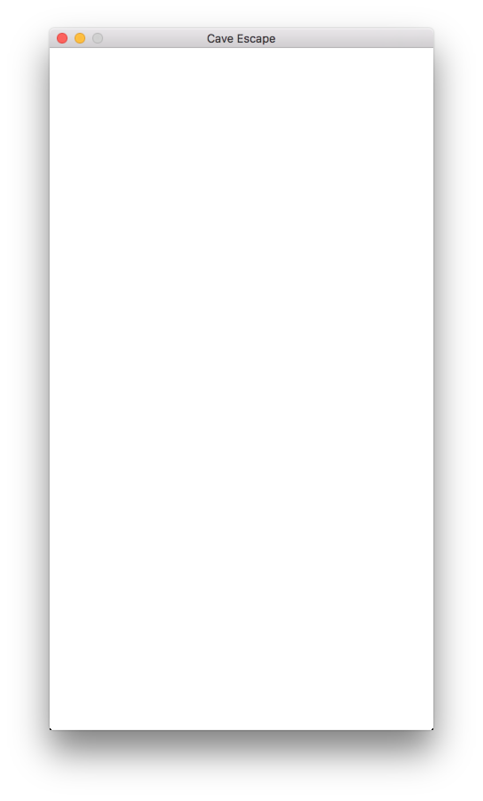
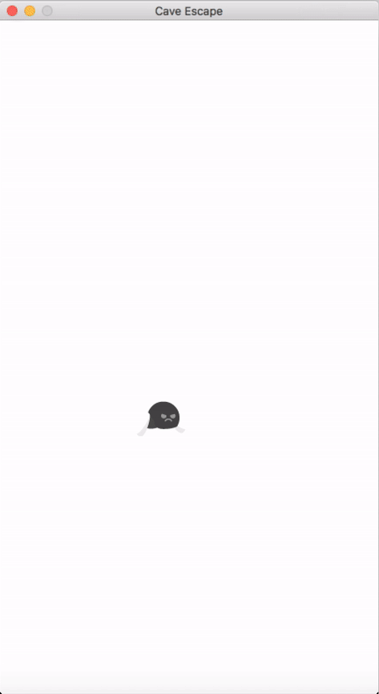

# 1. Iteration One

In the first iteration of Cave Escape, you will implement the boiler plate code for a simple game. The boiler plater code includes the instructions to open a graphics window and the execution of a basic game loop, where all of the instructions that you implement will be called from.

## What to Expect

Once you're finished working through and implementing iteration one, you should have something that looks just like this:





That's it! Just a blank graphics window, but we'll work on that blank canvas in future iterations.

## Code

### - Complete Code
The complete code for iteration one is as follows:

```pascal
program GameMain;
uses SwinGame, sgTypes, sgTimers, sgSprites, sysUtils;

procedure Main();
begin
  OpenGraphicsWindow('Cave Escape', 432, 768);

  repeat // The game loop...
    ProcessEvents();
    ClearScreen(ColorWhite);
    RefreshScreen();
  until WindowCloseRequested();
end;

begin
  Main();
end.
```

### - How it's Working
The ```Main()``` procedure, as demonstrated in the code above, is responsible for executing all of the instructions required for our game to run. The instructions are executed in sequence, meaning that the code within the ```Main()``` procedure will be executed in the exact order in which it is specified.

So, that being said, let's take a moment to analyse the ```Main()``` procedure and the instructions it is executing. The sequence is as follows:

  1. Firstly, a call to ```OpenGraphicsWindow()``` is made, where we can see the title of the window being opened is Cave Escape and the width and height of the window is 432 by 768 pixels.
  2. The game loop is opened. The game loop will loop over and over, until the user closes the window, meaning all of the instructions will be continually executed for as long as the loop is running. Note that the condition of the loop is ```WindowCloseRequested()```.
     * The following instructions are executed within the game loop:
      1. ```ProcessEvents()``` is called. ```ProcessEvents()``` is used to listen for any user input made while the program is running.
      2. We then clear the screen with ```ClearScreen()``` before we draw anything to it (we're not drawing anything in this iteration, but that will come soon!).
      3. We then refresh the screen with ```RefreshScreen()``` so that we can see what we've drawn.

### Have a Crack
Now it's time for you to have a go at implementing iteration one on your own. You'll have to type the instructions above into your text editor. Try and resist the urge to copy and paste code if it arrises, as typing it out helps build your understanding in regards to what the code is doing. When you're done, you'll need to build and run your code to see if it is all working. If you encounter any build errors, you'll have to resolve those and build and run again.

---
# 2. Iteration Two

In the second iteration of Cave Escape, you will implement the functionality to have your game produce a graphical representation of the player. The player will be drawn to the centre of the graphics window and come complete with an animation!

## What to Expect

Once you're finished working through and implementing iteration two, you should have something that looks just like this:


What's different from iteration one? We've got a graphical representation of the game's player! Now let's take a look at how this is implemented.

## Code

### - New Code
The new code in iteration two is as follows:

#### Addition one
```pascal    
function GetNewPlayer(): Sprite;
begin
  result := CreateSprite(BitmapNamed('Player'), AnimationScriptNamed('PlayerAnimations'));
  SpriteSetX(result, ScreenWidth() / 2 - SpriteWidth(result));
  SpriteSetY(result, ScreenHeight() / 2);
  SpriteStartAnimation(result, 'Fly');
end;
```
- The ```GetNewPlayer()``` function, as demonstrated in the code above, is used to generate the data associated with the player entity that we'll be using in our game. It's important to note that functions use a special variable called ```result``` to store the value in that they calculate. So, in short, the function is creating a sprite for the player, setting the sprite's location to the centre of the screen and setting an animation for the sprite. Once the function finishes, it returns the sprite it creates (the ```result``` variable).

### - Complete Code
The complete code for iteration two can be found [here](../Pascal/CaveEscape/src/CaveEscape2.pas).

### - You've Changed, Main
```pascal
procedure Main();
var
  player: Sprite;
begin
  OpenGraphicsWindow('Cave Escape', 432, 768);
  LoadResourceBundleNamed('CaveEscape', 'CaveEscape.txt', false);

  player := GetNewPlayer();

  repeat // The game loop...
    ProcessEvents();
    ClearScreen(ColorWhite);
    UpdateSprite(player);
    DrawSprite(player);
    RefreshScreen();
  until WindowCloseRequested();
end;
```

Take a close look at the ```Main()``` procedure. A few things have changed in order to cater for our new ```GetNewPlayer()``` function as well as drawing our player to the screen. The sprite that the function ```GetNewPlayer()``` returns is assigned to a variable called ```player``` and then within the game loop, the player sprite is updated and drawn.

### Have a Crack
Now it's time for you to have a go at implementing iteration two on your own. As before, you'll have to type the instructions above into your text editor. Continue to try and resist the urge to copy and paste code if it arrises, as typing it out helps build your understanding in regards to what the code is doing. When you're done, you'll need to build and run your code to see if it is all working. If you encounter any build errors, you'll have to resolve those and build and run again.

---
# 3. Iteration Three

In the third iteration of Cave Escape, you will implement the functionality to give your player the ability to fly! Well, almost. You're going to add some velocity to the player so that it's not just stuck in the middle of the screen, instead, when you're finished, the player will fall right off the bottom of the screen!

## What to Expect

Once you're finished working through and implementing iteration three, you should have something that looks just like this:


So with some velocity, the game is a little more dynamic than it previously was in iteration two.

## Code

### - New Code
The new code in iteration three is as follows:

#### Addition one
```pascal
const
  GRAVITY = 0.08;
  MAX_SPEED = 5;
```
- We've taken the time to add some constant values that are going to be used in the calculation of the player's velocity. Those values represent an imposed ```GRAVITY``` and a ```MAX_SPEED``` in regards to what we want to impose as the maximum velocity the player can move, or fall at.

#### Addition two
```pascal    
procedure UpdateVelocity(var player: Sprite);
begin
  SpriteSetDy(player, SpriteDy(player) + GRAVITY);

  if SpriteDy(player) > MAX_SPEED then
  begin
    SpriteSetDy(player, MAX_SPEED);
  end
  else if SpriteDy(player) < -(MAX_SPEED) then
  begin
    SpriteSetDy(player, -(MAX_SPEED));
  end;
end;
```
- The ```UpdateVelocity()``` procedure, as demonstrated in the code above, uses these two new constant values to determine what the player's speed will be by using conditional statements. The conditional statements ensure that ```if``` the player is not already falling at the ```MAX_SPEED```, increase it's velocity, ```else if``` the player is already falling at the ```MAX_SPEED```, ensure that it stays falling at the ```MAX_SPEED``` rather than going any faster.

### - Complete Code
The complete code for iteration three can be found [here](../Pascal/CaveEscape/src/CaveEscape3.pas).

### - Take a Look at Main
```pascal
procedure Main();
var
  player: Sprite;
begin
  OpenGraphicsWindow('Cave Escape', 432, 768);
  LoadResourceBundleNamed('CaveEscape', 'CaveEscape.txt', false);

  player := GetNewPlayer();

  repeat // The game loop...
    ProcessEvents();
    ClearScreen(ColorWhite);
    UpdateVelocity(player);
    UpdateSprite(player);
    DrawSprite(player);
    RefreshScreen();
  until WindowCloseRequested();
end;
```

The ```Main()``` procedure has now changed. Notice that in the game loop, there's now a call to the new procedure ```UpdateVelocity()```. This ensures that for each time the game loop executes, we're ensuring that we're updating the player's velocity accordingly.

### Have a Crack
Now it's time for you to have a go at implementing iteration three on your own. Give it a crack and see how you go.

---
# 4. Iteration Four

In the fourth iteration of Cave Escape, we will actually implement the ability to have you control the way the player flies. Instead of the player just falling into the abyss, as it was in iteration three, iteration four sees the inclusion of the logic required to keep the player on the screen by using keyboard input. In particular, we're going to make it so that every time the space bar is pressed, the player is going to fly a little higher, and further away from the bottom of the screen.

## What to Expect

Once you're finished working through and implementing iteration four, you should have something that looks just like this:


Look at that! Control over the player's velocity!

## Code

### - New Code
The new code in iteration four is as follows:

#### Addition one (Note: There is a new constant value)
```pascal
const
  GRAVITY = 0.08;
  MAX_SPEED = 5;
  JUMP_RECOVERY_BOOST = 2;
```
- In order to be able to control the player's velocity with user input, we've had to add a new constant value called ```JUMP_RECOVERY_BOOST```. The reason for this will become more clear when we talk about the new procedure ```HandleInput()```.

#### Addition two
```pascal    
procedure HandleInput(var player: Sprite);
begin
  if KeyTyped(SpaceKey) then
  begin
    SpriteSetDy(player, SpriteDy(player) - JUMP_RECOVERY_BOOST);
  end;
end;
```
- The new procedure ```HandleInput()``` is implemented to listen for user input while the game is running. Specifically, the input it's listening for is when the space bar is pressed. Every time the space bar is pressed, the ```HandleInput()``` procedure will decrement the value of the constant ```JUMP_RECOVERY_BOOST``` from the player's current velocity, meaning, that each time the space bar is pressed, the player will fall a little slower, but only briefly. The aim is to have the user continually press the space bar to keep the player on the screen and give it the affect of flying!

### - Complete Code
The complete code for iteration four can be found [here](../Pascal/CaveEscape/src/CaveEscape4.pas).

### - Main has Changed, Again
```pascal
procedure Main();
var
  player: Sprite;
begin
  OpenGraphicsWindow('Cave Escape', 432, 768);
  LoadResourceBundleNamed('CaveEscape', 'CaveEscape.txt', false);

  player := GetNewPlayer();

  repeat // The game loop...
    ProcessEvents();
    ClearScreen(ColorWhite);
    UpdateVelocity(player);
    HandleInput(player);
    UpdateSprite(player);
    DrawSprite(player);
    RefreshScreen();
  until WindowCloseRequested();
end;
```

The ```Main()``` procedure has now changed. Notice that in the game loop, there's now a call to the new procedure ```HandleInput()```. This ensures that for each time the game loop executes, we're ensuring that we're listening for any user input, specifically, if the space bar has been pressed. Now we have a more functional game where the user finally has some control over the way the game behaves.


### Have a Crack
Now it's time for you to have a go at implementing iteration four on your own.

---
# 5. Iteration Five

In the fifth iteration of Cave Escape, we add quite a bit of functionality, more so than in the previous iterations. We're up for a big step with this one. We're going to add an obstacle. We'll refer to the obstacle as a set of poles. It's the aim of the game to avoid the poles, but we'll worry about that later. For now, let's just worry about getting the poles onto the screen. So, this iteration concerns the generation of a single set of poles as well as the way the poles behave.

## What to Expect

Once you're finished working through and implementing iteration five, you should have something that looks just like this:


While iteration five is quite a bit involved, in terms of new code required, it adds loads of functionality to our game and now, more than ever, it's looking more and more like a game.

## Code

### - New Code
The new code in iteration five is as follows:

#### Addition one (Note: There is a new constant value)
```pascal
const
  GRAVITY = 0.08;
  MAX_SPEED = 5;
  JUMP_RECOVERY_BOOST = 2;
  POLE_SCROLL_SPEED = -2;
```
- The poles that we're adding to the game will move horizontally across the screen, from left to right. In order to cater for this, we've added another constant called ```POLE_SCROLL_SPEED``` in order to keep track of the speed at which the poles travel across the screen.

#### Addition two
```pascal    
type
  PoleData = record
    UpPole: Sprite;
    DownPole: Sprite;
  end;
```
- In order to be able to keep track of the data required to add the poles to the game, we've added a record called ```PoleData```. If you take a look at the ```PoleData``` record, you'll notice that it has two fields as sprites. ```PoleData``` needs two sprites because one pole will come down from the top of the screen and the other will come up from the bottom.

#### Addition three
```pascal    
function GetRandomPoles(): PoleData;
begin
  result.UpPole := CreateSprite(BitmapNamed('UpPole'));
  result.DownPole := CreateSprite(BitmapNamed('DownPole'));
  SpriteSetX(result.UpPole, ScreenWidth() + RND(1200));
  SpriteSetY(result.UpPole, ScreenHeight() - SpriteHeight(result.UpPole));
  SpriteSetX(result.DownPole, SpriteX(result.UpPole));
  SpriteSetY(result.DownPole, 0);
  SpriteSetDx(result.UpPole, POLE_SCROLL_SPEED);
  SpriteSetDx(result.DownPole, POLE_SCROLL_SPEED);
end;
```
- Now, we need some logic in order to be able to add the poles to the game so that we can see them. Firstly, we've got a new function called ```GetRandomPoles()```, which is responsible for generating the data associated with the poles. This function behaves similarly to the function ```GetNewPlayer()```, as discussed in iteration two. ```GetRandomPoles()``` assigns the top and bottom poles their own sprites, sets their x location to a random location off the far right of the screen (this is intentional because we want to see the poles scroll onto the screen from the right) and sets their y locations so that they appear to be coming down from the top and up from the bottom of the screen. Finally, the function assigns their delta x, or horizontal movement speed to that of the value of the constant ```POLE_SCROLL_SPEED```.

#### Addition four
```pascal    
procedure UpdatePoles(var poles: PoleData);
begin
  UpdateSprite(poles.UpPole);
  UpdateSprite(poles.DownPole);
end;
```
- A procedure called ```UpdatePoles()``` has been added to update the poles.

#### Addition five
```pascal    
procedure DrawPoles(poles: PoleData);
begin
  DrawSprite(poles.UpPole);
  DrawSprite(poles.DownPole);
end;
```
- A procedure called ```DrawPoles()``` has been added to draw the poles to the screen.

### - Complete Code
The complete code for iteration five can be found [here](../Pascal/CaveEscape/src/CaveEscape5.pas).

### - More Changes to Main
```pascal
procedure Main();
var
  player: Sprite;
  gamePoles: PoleData;
begin
  OpenGraphicsWindow('Cave Escape', 432, 768);
  LoadResourceBundleNamed('CaveEscape', 'CaveEscape.txt', false);

  player := GetNewPlayer();

  gamePoles := GetRandomPoles();

  repeat // The game loop...
    ProcessEvents();
    ClearScreen(ColorWhite);
    UpdateVelocity(player);
    HandleInput(player);
    UpdateSprite(player);
    DrawSprite(player);
    UpdatePoles(gamePoles);
    DrawPoles(gamePoles);
    RefreshScreen();
  until WindowCloseRequested();
end;
```
The ```Main()``` procedure has now changed. Notice that we're now using our new function ```GetRandomPoles()``` and assigning the value it returns to a variable called ```gamePoles```. In order to move the poles across the screen and draw them, we've added the calls to the procedures ```UpdatePoles()``` and ```DrawPoles()``` within the game loop.

### Have a Crack
Now it's time for you to have a go at implementing iteration five on your own.

---
# 6. Iteration Six

In the sixth iteration of Cave Escape, we're going to make a few additions to ensure that once the poles move off the far left of the screen, they get moved back default position. This will ensure that the poles can be reused as obstacles.

## What to Expect

Once you're finished working through and implementing iteration six, you should have something that looks just like this:





The poles are much better when they wrap around the game screen!

## Code

### - New Code
The new code in iteration six is as follows:

#### Addition one
```pascal
procedure ResetPoleData(var poles: PoleData);
begin
  FreeSprite(poles.UpPole);
  FreeSprite(poles.DownPole);
  poles := GetRandomPoles();
end;
```
- We've added a new procedure called ```ResetPoleData()``` that is going to reset the poles once they move off the left of screen. Notice that it calls the function ```GetRandomPoles()``` that we implemented before. It makes sense to reuse code where you can, and the poles that the function ```GetRandomPoles()``` returns are exactly what we need when we have to reset them.

#### Addition two (Note: ```UpdatePoles()``` has had code added to it)
```pascal    
procedure UpdatePoles(var poles: PoleData);
begin
  UpdateSprite(poles.UpPole);
  UpdateSprite(poles.DownPole);

  if ((SpriteX(poles.UpPole) + SpriteWidth(poles.UpPole)) < 0) and ((SpriteX(poles.DownPole) + SpriteWidth(poles.DownPole)) < 0) then
  begin
    ResetPoleData(poles);
  end;
end;
```
- We've modified ```UpdatePoles()``` to check to see if the poles have moved off the left of the screen and ```if``` they have, we simply reset them.

### - Complete Code
The complete code for iteration six can be found [here](../Pascal/CaveEscape/src/CaveEscape6.pas).

### - Any Changes to Main
Not in this iteration. Hurray!

### Have a Crack
Now it's time for you to have a go at implementing iteration six on your own.

---
# 7. Iteration Seven

In iteration seven of Cave Escape, we're going to implement the logic to have more than one set of poles. One set of poles is simply not challenging enough, and the overall change in logic to suit such functionality is quite minor.

## What to Expect

Once you're finished working through and implementing iteration seven, you should have something that looks just like this:


Now we have lots of poles!

## Code

### - New Code
The new code in iteration seven is as follows:

#### Addition one (Note: There is a new constant value)
```pascal
const
  GRAVITY = 0.08;
  MAX_SPEED = 5;
  JUMP_RECOVERY_BOOST = 2;
  POLE_SCROLL_SPEED = -2;
  NUM_POLES = 4;
```
- We've added a constant called ```NUM_POLES``` to store the number of sets of poles we want in the game. The code provided has ```NUM_POLES``` being equal to the value of four, so this means there will be exactly four sets of poles in the game.

#### Addition two
```pascal    
Poles = array [0..NUM_POLES - 1] of PoleData;
```
- The second addition is an array of ```PoleData``` called ```Poles```. This array is where our four sets of poles will be stored. You can see the array is declared as such ```Poles = array [0..NUM_POLES - 1] of PoleData;```. It's important to understand the logic in the square bracers ```[0..NUM_POLES - 1]```. Now, ```NUM_POLES``` is four, so ```NUM_POLES - 1``` is equal to three, so the logic equates to ```[0..3]```. Computers are zero based, meaning that our first set of poles is actually denoted the numerical value of zero, the second set is denoted one, the third set two and the fourth set three! Moving on.

#### Addition three (Note: ```UpdatePoles()``` has had code added to it)
```pascal    
procedure UpdatePoles(var poles: Poles);
var
  i: Integer;
begin
  for i:= Low(poles) to High(poles) do
  begin
    UpdateSprite(poles[i].UpPole);
    UpdateSprite(poles[i].DownPole);

    if ((SpriteX(poles[i].UpPole) + SpriteWidth(poles[i].UpPole)) < 0) and ((SpriteX(poles[i].DownPole) + SpriteWidth(poles[i].DownPole)) < 0) then
    begin
      ResetPoleData(poles[i]);
    end;
  end;
end;
```
- ```UpdatePoles()``` has only changed to work with our new array of poles instead of just working with a single set of poles. Notice that the procedure is using a ```for``` loop to make sure every set of poles in the array is updated.

#### Addition four (Note: ```DrawPoles()``` has had code added to it)
```pascal    
procedure DrawPoles(poles: Poles);
var
  i: Integer;
begin
  for i:= Low(poles) to High(poles) do
  begin
    DrawSprite(poles[i].UpPole);
    DrawSprite(poles[i].DownPole);
  end;
end;
```
-  ```DrawPoles()``` has only changed to work with our new array of poles instead of just working with a single set of poles. Notice that the procedure is using a ```for``` loop to make sure every set of poles in the array is drawn.

### - Complete Code
The complete code for iteration seven can be found [here](../Pascal/CaveEscape/src/CaveEscape7.pas).

### - Any Changes to Main
```pascal
procedure Main();
var
  player: Sprite;
  gamePoles: Poles;
  i: Integer;
begin
  OpenGraphicsWindow('Cave Escape', 432, 768);
  LoadResourceBundleNamed('CaveEscape', 'CaveEscape.txt', false);

  player := GetNewPlayer();

  for i:= Low(gamePoles) to High(gamePoles) do
  begin
    gamePoles[i] := GetRandomPoles();
  end;

  repeat // The game loop...
    ProcessEvents();
    ClearScreen(ColorWhite);
    UpdateVelocity(player);
    HandleInput(player);
    UpdateSprite(player);
    DrawSprite(player);
    UpdatePoles(gamePoles);
    DrawPoles(gamePoles);
    RefreshScreen();
  until WindowCloseRequested();
end;
```
Instead of the variable ```gamePoles``` being a value of ```PoleData```, it is now a value of our array, ```Poles```. We've also added a ```for``` loop to ensure that we set up all of the poles for the game.

### Have a Crack
Now it's time for you to have a go at implementing iteration seven on your own.

---
# 8. Iteration Eight

In iteration eight of Cave Escape, we're going to focus a fair bit on polishing the game in terms of visual aesthetics and code presentation. Visually, the game is going to be practically complete after the eighth iteration. We're going to include a scrolling background for the game to help set the scene. The code tidy up involved in iteration eight is purely for convention and to conform to best practice of having well presented, readable code. This iteration sees the addition of nine new code additions, so it is quite busy.

## What to Expect

Once you're finished working through and implementing iteration eight, you should have something that looks just like this:


That scrolling background really complements the theme of the game!

## Code

### - New Code
The new code in iteration eight is as follows:

#### Addition one (Note: There is a new constant value and the constant ```POLE_SCROLL_SPEED``` has been changed to ```FOREGROUND_FOREROOF_POLE_SCROLL_SPEED```)
```pascal
const
  GRAVITY = 0.08;
  MAX_SPEED = 5;
  JUMP_RECOVERY_BOOST = 2;
  FOREGROUND_FOREROOF_POLE_SCROLL_SPEED = -2;
  BACKGROUND_SCROLL_SPEED = -1;
  NUM_POLES = 4;
```
- In order to cater for the game's new visual background, we've changed the constant ```POLE_SCROLL_SPEED``` to ```FOREGROUND_FOREROOF_POLE_SCROLL_SPEED```, because the roof element of the background is going to have the same scrolling speed as the poles. We've also added another constant ```BACKGROUND_SCROLL_SPEED``` to store the value at which we want the background to scroll at. These values ```FOREGROUND_FOREROOF_POLE_SCROLL_SPEED``` and ```BACKGROUND_SCROLL_SPEED``` are different because we want to create parallax scrolling.

#### Addition two
```pascal    
BackgroundData = record
  Foreroof: Sprite;
  Foreground: Sprite;
  Background: Sprite;
end;
```
- ```BackgroundData``` has been added to house all the information related to the game's background. Notice it consists of three separate sprites, ```Foreroof```, ```Foreground``` and ```Background```.

#### Addition three
```pascal    
GameData = record
  Player: Sprite;
  Scene: BackgroundData;
  Poles: Poles;
end;
```
-  The record ```GameData``` has been added to house all the information that the game relies upon, like the player, background and the poles. We'll talk more about this a little later when we discuss how the ```Main()``` procedure has changed in this iteration.

#### Addition four
```pascal    
function GetNewBackground(): BackgroundData;
begin
  result.Background := CreateSprite(BitmapNamed('Background'));
  SpriteSetX(result.Background, 0);
  SpriteSetY(result.Background, 0);
  SpriteSetDx(result.Background, BACKGROUND_SCROLL_SPEED);

  result.Foreground := CreateSprite(BitmapNamed('Foreground'), AnimationScriptNamed('ForegroundAminations'));
  SpriteSetX(result.Foreground, 0);
  SpriteSetY(result.Foreground, ScreenHeight() - SpriteHeight(result.Foreground));
  SpriteSetDx(result.Foreground, FOREGROUND_FOREROOF_POLE_SCROLL_SPEED);
  SpriteStartAnimation(result.Foreground, 'Fire');

  result.Foreroof := CreateSprite(BitmapNamed('Foreroof'));
  SpriteSetX(result.Foreroof, 0);
  SpriteSetY(result.Foreroof, 0);
  SpriteSetDx(result.Foreroof, FOREGROUND_FOREROOF_POLE_SCROLL_SPEED);
end;
```
- Now, we need some logic in order to be able to add the background to the game so that we can see it. Firstly, we've got a new function called ```GetNewBackground()```, which is responsible for generating the data associated with the background. This function behaves similarly to the functions ```GetNewPlayer()``` and ```GetRandomPoles()```. ```GetNewBackground()``` returns a value of ```BackgroundData```, and as you can see, it is responsible for setting all of the values within the ```BackgroundData``` record. It sets the sprites for the ```Foreroof```, ```ForeGround``` and ```Background```, as well as their locations and the animation for the ```ForeGround``` sprite. Because the background has a scrolling affect, the delta x, or horizontal movement speed of the three sprites have been set accordingly.

#### Addition five
```pascal
procedure UpdateBackground(scene: BackgroundData);
begin
  UpdateSprite(scene.ForeGround);
  UpdateSprite(scene.Foreroof);
  updateSprite(scene.Background);
  if (SpriteX(scene.Foreground) <= -(SpriteWidth(scene.ForeGround) / 2)) then
  begin
    SpriteSetX(scene.Foreground, 0);
    SpriteSetX(scene.Foreroof, 0);
  end;
  if (SpriteX(scene.Background) <= -(SpriteWidth(scene.Background) / 2)) then
  begin
    SpriteSetX(scene.Background, 0);
  end;
end;
```
- A new procedure called ```UpdateBackground()``` has been added to ensure the background wraps continuously around the screen, similar to the fashion in which the poles do. The logic within the procedure makes sure that the game scene always renders the background in a manner which makes the scrolling of the images seem infinite.

#### Addition six
```pascal
procedure UpdatePlayer(player: Sprite);
begin
  UpdateVelocity(player);
  UpdateSprite(player);
end;
```
- The procedure ```UpdatePlayer()``` has been added so that the logic to update the player can be moved out of the ```Main()``` procedure into a separate procedure which focusses exclusively on managing the player element. We've done this to conform to good conventional practice and to apply what is called modular decomposition. Briefly, modular decomposition involves separating code into logical blocks, which are focussed on a specific task, I.e. updating the player.

#### Addition seven
```pascal
procedure UpdateGame(var game: GameData);
begin
  HandleInput(game.Player);
  UpdateBackground(game.Scene);
  UpdatePlayer(game.Player);
  UpdatePoles(game.Poles);
end;
```
- A procedure called ```UpdateGame()``` has been added, for the same reasons as the procedure ```UpdatePlayer()```. More application of good practice and a general code tidy up.

#### Addition eight
```pascal
procedure DrawGame(const game: GameData);
begin
  DrawSprite(game.Scene.Background);
  DrawPoles(game.Poles);
  DrawSprite(game.Scene.Foreroof);
  DrawSprite(game.Scene.ForeGround);
  DrawSprite(game.Player);
end;
```
- Yet another procedure has been added to apply modular decomposition to our game. ```DrawGame()``` has been created to house all the calls, which are responsible for drawing the game elements to the screen.

#### Addition nine
```pascal
procedure SetUpGame(var game: GameData);
var
  i: Integer;
begin
  LoadResourceBundleNamed('CaveEscape', 'CaveEscape.txt', false);
  for i:= Low(game.Poles) to High(game.Poles) do
  begin
    game.Poles[i] := GetRandomPoles();
  end;
  game.Player := GetNewPlayer();
  game.Scene := GetNewBackground();
end;
```
- Finally, this big iteration concludes with the addition of a new procedure called ```SetUpGame()```. Out of good practice, we've move all the game setup calls from the ```Main()``` procedure into a single procedure called ```SetUpGame()```. It is here where all the game elements are instantiated, such as the player, background and poles.

### - Complete Code
The complete code for iteration eight can be found [here](../Pascal/CaveEscape/src/CaveEscape8.pas).

### - A Little Change to Main
```pascal
procedure Main();
var
  game: GameData;
begin
  OpenGraphicsWindow('Cave Escape', 432, 768);
  SetUpGame(game);

  repeat // The game loop...
    ProcessEvents();
    ClearScreen(ColorWhite);
    UpdateGame(game);
    DrawGame(game);
    RefreshScreen();
  until WindowCloseRequested();
end;
```

Look how tidy the ```Main()``` procedure looks now after our code tidy up. We now only have a single variable called ```game```, which is a value of ```GameData```. We call our new procedure ```SetUpGame()``` before the game loop to set the game up, then in our game loop, we have calls to ```UpdateGame()``` and ```DrawGame()```, which handle everything else that the game depends on.

### Have a Crack
Now it's time for you to have a go at implementing iteration eight on your own.

---
# 9. Iteration Nine

Iteration nine is going to be quite a big one too, where there are some big changes to improve gameplay in order to make our game....well, more of a game. In this iteration, we're going to add some music to give the game it's own little soundtrack, which will make the experience more immersive. The big changes, on top of the music, are the addition of collisions, so the player can collide with the environment, a scoring system and the ability to have the game reset if the player does collide with the environment. Iteration nine very nearly implements a completely functional game, ready for shipping.

## What to Expect

Once you're finished working through and implementing iteration nine, you should have something that looks just like this:


We're getting closer and closer to a complete game!

## Code

### - New Code
The new code in iteration nine is as follows:

#### Addition one (Note: The record ```PoleData``` has changed)
```pascal
PoleData = record
  ScoreLimiter: Boolean;
  UpPole: Sprite;
  DownPole: Sprite;
end;
```
- We've added a field to our record ```PoleData``` called ```ScoreLimiter```. We need this to be able to make the scoring system work. We'll talk more about that soon. Promise.

#### Addition two
```pascal    
Player = record
  Sprite: Sprite;
  Score: Integer;
  IsDead: Boolean;
end;
```
- We've added a new record called ```Player```. Our player can no longer just be a sprite. If you take a look at the record, you'll notice it has three fields. The first of which is our player sprite. The next being the ```Score``` and the third being a field called ```IsDead```. We need this field to tell the game when the player dies, from colliding with the environment.

#### Addition three (Note: The record ```GameData``` has changed)
```pascal    
GameData = record
  Player: Player;
  Scene: BackgroundData;
  Poles: Poles;
end;
```
- The ```GameData``` record has changed only slightly. Instead of the ```Player``` field being just a sprite, it is now a value of our new record ```Player```.

#### Addition four (Note: The function ```GetNewPlayer()``` has changed)
```pascal    
function GetNewPlayer(): Player;
begin
  result.Sprite := CreateSprite(BitmapNamed('Player'), AnimationScriptNamed('PlayerAnimations'));
  SpriteSetX(result.Sprite, ScreenWidth() / 2 - SpriteWidth(result.Sprite));
  SpriteSetY(result.Sprite, ScreenHeight() / 2);
  SpriteStartAnimation(result.Sprite, 'Fly');
  result.Score := 0;
  result.IsDead := false;
end;
```
- Our function ```GetNewPlayer()``` has had to change in order to support the new scoring system as well as our collision system. In the function we now set the ```Score``` to zero and set the player to be alive when the function is called.

#### Addition five (Note: The function ```GetRandomPoles()``` has changed)
```pascal
function GetRandomPoles(): PoleData;
begin
  result.UpPole := CreateSprite(BitmapNamed('UpPole'));
  result.DownPole := CreateSprite(BitmapNamed('DownPole'));
  SpriteSetX(result.UpPole, ScreenWidth() + RND(1200));
  SpriteSetY(result.UpPole, ScreenHeight() - SpriteHeight(result.UpPole) - RND(BitmapHeight(BitmapNamed('Foreground'))));
  SpriteSetX(result.DownPole, SpriteX(result.UpPole));
  SpriteSetY(result.DownPole, RND(BitmapHeight(BitmapNamed('Foreroof'))));;
  SpriteSetDx(result.UpPole, FOREGROUND_FOREROOF_POLE_SCROLL_SPEED);
  SpriteSetDx(result.DownPole, FOREGROUND_FOREROOF_POLE_SCROLL_SPEED);
  result.ScoreLimiter := true;
end;
```
- The ```GetRandomPoles()``` function has also changed. Only slightly, though. Notice that now the function sets the ```PoleData``` value that it returns to have a ```ScoreLimiter``` value of ```true``` and also, the positioning of the poles in terms of their vertical position is random. Because we have the roof and the floor, we can position the poles more dynamically. Now, we're going to use the ```ScoreLimiter``` to increment the ```Score``` of the player every time they pass a set of poles. Once they pass a set of poles, the player's* ```Score``` will be incremented and the ```ScoreLimiter``` for that set of poles will be set to ```false```. The reasoning behind this will become more clear when we talk about the changes made to ```UpdatePoles()```.

#### Addition six (Note: The procedure ```UpdatePoles()``` has changed)
```pascal
procedure UpdatePoles(var poles: Poles; var player: Player);
var
  i: Integer;
begin
  for i:= Low(poles) to High(poles) do
  begin
    UpdateSprite(poles[i].UpPole);
    UpdateSprite(poles[i].DownPole);

    if SpriteX (poles[i].UpPole) < (SpriteX(player.Sprite)) then
    begin
      if (poles[i].ScoreLimiter = true) then
      begin
        poles[i].ScoreLimiter := false;
        player.Score += 1;
      end;
    end;

    if ((SpriteX(poles[i].UpPole) + SpriteWidth(poles[i].UpPole)) < 0) and ((SpriteX(poles[i].DownPole) + SpriteWidth(poles[i].DownPole)) < 0) and (poles[i].ScoreLimiter = false) then
    begin
      ResetPoleData(poles[i]);
    end;
  end;
end;
```
- Now we're going to take a look at the changes made to ```UpdatePoles()```. Take a close look at the conditional statements in this procedure. In particular, let's focus on this conditional section of code here ```if SpriteX (poles[i].UpPole) < (SpriteX(player.Playing)) then``` to understand why we need the ```ScoreLimiter```. Firstly, we're checking to see if the player has passed any poles. That's what the first ```if``` statement is checking for. Now, the ```if``` statement inside the first one (we call this nested) is checking to see if the ```ScoreLimiter``` is ```true```, and ```if``` it is, we then set it to ```false``` and increment the ```Player's``` ```Score```. Now, it has to change to ```false``` because, if it never did, once the player passes some poles, the first ```if``` statement would be ```true``` and the ```Player's``` score would keep incrementing because the player would be beyond the poles. Phew. Tongue twisting. The best way to see the bug that this would cause is to remove the nested ```if``` statement and see what happens for yourself.

#### Addition seven
```pascal
procedure CheckForCollisions(var game: GameData);
var
  i: Integer;
begin
  if (SpriteCollision(game.Player.Sprite, game.Scene.Foreground)) or (SpriteCollision(game.Player.Sprite, game.Scene.Foreroof)) then
  begin
    game.Player.IsDead := true;
    exit;
  end;

  for i := Low(game.Poles) to High(game.Poles) do
  begin
    if SpriteCollision(game.Player.Sprite, game.Poles[i].UpPole) or SpriteCollision(game.Player.Sprite, game.Poles[i].DownPole)then
    begin
      game.Player.IsDead := true;
      exit;
    end;
  end;
end;
```
- We've got a new procedure called ```CheckForCollisions()```. The role of this procedure is to check to see if the player has collided with any of the eligible game elements (the poles, the roof and the floor). ```If``` the player does collide with anything that it shouldn't, we set the ```Player's``` ```IsDead``` to ```true```.

#### Addition eight
```pascal
procedure ResetPlayer(var player: Player);
begin
  FreeSprite(player.Sprite);
  player := GetNewPlayer();
end;
```
- Another new procedure called ```ResetPlayer()``` has been added to reset the ```Player``` to a default state. When we mention default state, we mean a new game where the score is zero and the player has to start over. This procedure is only used when the ```Player``` dies (collides with the environment).

#### Addition nine
```pascal
procedure ResetGame(var game: GameData);
var
  i: Integer;
begin
  ResetPlayer(game.Player);
  for i:= Low(game.Poles) to High(game.Poles) do
  begin
    ResetPoleData(game.Poles[i]);
  end;
end;
```
- A procedure called ```ResetGame()``` has been added to reset the game to the default state. This procedure is only used when the player dies.

#### Addition ten (Note: The procedure ```UpdateGame()``` has changed)
```pascal
procedure UpdateGame(var game: GameData);
begin
  if not (game.Player.IsDead) then
  begin
    CheckForCollisions(game);
    HandleInput(game.Player.Playing);
    UpdateBackground(game.Scene);
    UpdatePlayer(game.Player.Playing);
    UpdatePoles(game.Poles, game.Player);
  end
  else //The player has died :(
  begin
    ResetGame(game);
  end;
end;
```
- The procedure ```UpdateGame()``` has changed in order to act upon the player dying. So, as long as the player is not dead, we want the game to run normally, you know, with poles scrolling across the screen that the player has to avoid. If the player has died, ```UpdateGame()``` knows when that happens and will reset the game.

#### Addition eleven (Note: The procedure ```DrawGame()``` has changed)
```pascal
procedure DrawGame(const game: GameData);
begin
  DrawSprite(game.Scene.Background);
  DrawPoles(game.Poles);
  DrawSprite(game.Scene.Foreroof);
  DrawSprite(game.Scene.ForeGround);
  DrawSprite(game.Player.Sprite);
  DrawText(IntToStr(game.Player.Score), ColorWhite, 'GameFont', 10, 0);
end;
```
- Finally, ```DrawGame()``` has changed to simply draw the score to the top left of the screen so that we can see how good....or bad we are at playing.

### - Complete Code
The complete code for iteration nine can be found [here](../Pascal/CaveEscape/src/CaveEscape9.pas).

### - You're the Same, Main
Main has not changed.

### Have a Crack
Now it's time for you to have a go at implementing iteration nine on your own.

---
# 10. Iteration Ten

Iteration ten is the final iteration for the game! In this final iteration we will add a menu to the game so that it only starts when the player is ready.

## What to Expect

Once you're finished working through and implementing iteration ten, you should have something that looks just like this:


We're done now!

## Code

### - New Code
The new code in iteration ten is as follows:

#### Addition one
```pascal
PlayerState = (Menu, Play);
```
- We've added an enumeration called ```PlayerState``` with two values, ```Menu``` and ```Play```. This enumeration is going to be used to help the game determine whether or not to show the menu or to let the player play.

#### Addition two (Note: The record ```Player``` has changed)
```pascal    
Player = record
  Sprite: Sprite;
  Score: Integer;
  IsDead: Boolean;
  State: PlayerState;
end;
```
-  Now because of the addition of the enumeration ```PlayerState```, we've changed the ```Player``` record to house the current game state. The new field is called ```State```.

#### Addition three (Note: The function ```GetNewPlayer``` has changed)
```pascal    
function GetNewPlayer(): Player;
begin
  result.Sprite := CreateSprite(BitmapNamed('Player'), AnimationScriptNamed('PlayerAnimations'));
  SpriteSetX(result.Sprite, ScreenWidth() / 2 - SpriteWidth(result.Sprite));
  SpriteSetY(result.Sprite, ScreenHeight() / 2);
  SpriteStartAnimation(result.Sprite, 'Fly');
  result.Score := 0;
  result.IsDead := false;
  result.State := Menu;
end;
```
- The function ```GetNewPlayer()``` has changed to set the value of the ```Player's``` new field ```State``` to ```Menu```. This way, we can ensure that the game starts in the menu state.

#### Addition four (Note: The procedure ```HandleInput()``` has changed)
```pascal    
procedure HandleInput(var player: Player);
begin
  if KeyTyped(SpaceKey) and (player.State = Play) then
  begin
    SpriteSetDy(player.Sprite, SpriteDy(player.Sprite) - JUMP_RECOVERY_BOOST);
  end
  else if KeyTyped(SpaceKey) then
  begin
    player.State := Play;
  end;
end;
```
- The procedure ```HandleInput()``` has changed to accommodate for the new menu state being implemented. Basically, the change ensures that ```if``` the game hasn't started yet (the ```Player's``` ```State``` is ```Menu```) and the player presses the space bar, we want to set the ```Player's``` ```State``` to ```Play```. If the player is already playing, then just handle the input like we normally would by boosting the player's velocity.

#### Addition five (Note: The procedure ```UpdatePlayer()``` has changed)
```pascal
procedure UpdatePlayer(player: Player);
begin
  if (player.State = Play) then
  begin
    UpdateVelocity(player.Sprite);
  end;
  UpdateSprite(player.Sprite);
end;
```
- ```UpdatePlayer()``` has also changed to suit the new menu state. The changes made ensure that we only update the player's velocity ```if``` the current ```State``` is set to ```Play```. Otherwise, the player will just hover in the middle of the screen. We're doing this so that the player only starts moving when we are ready to play!

#### Addition six (Note: The procedure ```UpdateGame()``` has changed)
```pascal
procedure UpdateGame(var game: GameData);
begin
  if not (game.Player.IsDead) then
  begin
    CheckForCollisions(game);
    HandleInput(game.Player);
    UpdateBackground(game.Scene);
    UpdatePlayer(game.Player);
    if (game.Player.State = Play) then
    begin
      UpdatePoles(game.Poles, game.Player);
    end;
  end
  else //The player has died :(
  begin
    ResetGame(game);
  end;
end;
```
- ```UpdateGame()``` also has a change to suit the menu state. The changes ensure that the poles only scroll across the screen if the player has started playing the game.

#### Addition seven (Note: The procedure ```DrawGame()``` has changed)
```pascal
procedure DrawGame(const game: GameData);
begin
  DrawSprite(game.Scene.Background);
  DrawPoles(game.Poles);
  DrawSprite(game.Scene.Foreroof);
  DrawSprite(game.Scene.ForeGround);
  DrawSprite(game.Player.Sprite);
  if (game.Player.State = Play) then
  begin
    DrawText(IntToStr(game.Player.Score), ColorWhite, 'GameFont', 10, 0);
  end
  else if (game.Player.State = Menu) then
  begin
    DrawBitmap(BitmapNamed('Logo'), 0, 40);
    DrawText('PRESS SPACE!',
    ColorWhite,
    'GameFont',
    ScreenWidth() / 2 - TextWidth(FontNamed('GameFont'), 'PRESS SPACE!') / 2,
    SpriteY(game.Player.Sprite) + TextHeight(FontNamed('GameFont'), ' ') * 2);
  end;
end;
```
- Finally, ```DrawGame()``` also has some minor changes. This is where we're drawing our new menu. So, ```if``` the player is not playing the game yet, we draw a menu to the screen for them, giving them instructions on how to start playing.

### - Complete Code
The complete code for iteration ten can be found [here](../Pascal/CaveEscape/src/CaveEscape10.pas).

### - Main Remains the Same
It really does.

### Have a Crack
Now it's time for you to have a go at implementing iteration ten on your own. You've done really well and you're pretty much done!
